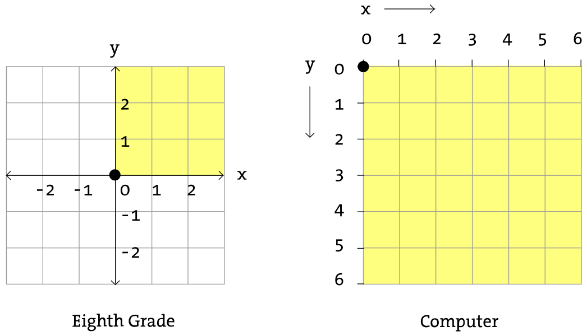

# Get Started

Mở [trình chỉnh sửa online của p5.js](https://editor.p5js.org/) và gõ:

```javascript
function setup() {
    createCanvas(400, 400)
}

function draw() {
    background(220);
    ellipse(50, 50, 80, 80)
}
```

Nhấn nút **Play** để hiển thị kết quả:


Dòng mã:

```javascript
function setup() {
    createCanvas(400, 400)
}
```

Tạo một bản vẽ có kích thước 400x400 pixel.

Tiếp theo:

```javascript
function draw() {
    background(220);
    ellipse(50, 50, 80, 80);
}
```

Lệnh `background(220)` tô màu nền màu xám với sắc độ `220` cho bản vẽ. Sau đó lệnh `ellipse(50, 50, 80, 80)` vẽ một hình elip với tâm có tọa độ `(50, 50)`, chiều rộng và chiều cao là `80` (hình tròn bán kính `80`).

Người dùng có thể tương tác với bản vẽ. Sửa đổi ví dụ của chúng ta thành:

```javascript
function setup() {
    createCanvas(400, 400);
}

function draw() {
    if (mouseIsPressed) {
        fill(0);
    } else {
        fill(255);
    }
    ellipse(mouseX, mouseY, 80, 80);
}
```


`mouseIsPressed` mô tả sự kiện người dùng bấm chuột, tọa độ của chuột được lưu trong hai biến `mouseX` và `mouseY`.

Lệnh `ellipse(mouseX, mouseY, 80, 80)` vẽ đường tròn có tâm tại vị trí của chuột, bán kính đường tròn bằng `80`.

Khi bấm chuột, hình tròn được tô đen, khi nhả chuột hình tròn được tô trắng.

# p5.js overview

## Hello world

Có hai hàm chính bạn sẽ sử dụng trong chương trình. Hàm `setup()` chạy một lần duy nhất, được dùng để khởi tạo hoặc tạo một chương trình không cần mã chạy lặp đi lặp lại. Hàm `draw()` chạy lặp lại và được sử dụng cho hoạt ảnh.

Ta viết chương trình đầu tiên của chúng ta như sau:

```javascript
function setup() {
    line(15, 25, 70, 90);
}
```

Nếu xem kết quả, bạn sẽ thấy một đoạn thẳng.

Thêm hàm `draw()` cho phép bạn tạo ra một hoạt ảnh. Trong ví dụ dưới đây, một biến được cập nhật mỗi khi chạy `draw()`, làm di chuyển một đường tròn trên màn hình.

```javascript
let x = 0;

function setup() {
    background(100);
}

function draw() {
    ellipse(x, height/2, 20, 20);
    x += 1;
}
```

## Tạo một bản vẽ

Mặc định, bản vẽ có kích thước 100x100. Nếu bạn muốn cài đặt kích thước tùy chỉnh, sử dụng hàm `createCanvas()`. Tốt hơn hết là luôn sử dụng nó trong `setup()`, ở dòng đầu tiên. Đoạn mã sau tạo một bản vẽ có kích thước 600x400:

```javascript
function setup() {
    createCanvas(600, 400);
    line(15, 25, 70, 90);
}
```

Mặc định bản vẽ được thêm vào HTML ngay sau các phần tử khác.

Để thêm bản vẽ vào một vị trí cụ thể trên trang HTML, trước tiên bạn có thể tạo một container chứa nó:

```html
<div id='myContainer'></div>
```

Sau đó sử dụng phương thức `parent()` của bản vẽ vừa tạo:

```javascript
function setup() {
    let myCanvas = createCanvas(600, 400);
    myCanvas.parent('myContainer');
}
```

## Tương tác bằng chuột và chạm

Đối với màn hình không cảm ứng, ta có thể tương tác với bản vẽ bằng chuột. Với màn hình cảm ứng, ta tương tác với bản vẽ bằng thao tác chạm ngón tay vào màn hình. p5.js hỗ trợ cả hai thao tác này.

| Chuột    | Chạm     |
| -------- | -------- |
| `mouseX` | `touchX` |
| `mouseY` | `touchY` |
|          | `touches[]` |
| `mouseIsPressed` | |
| `mousePressed()` | `touchStarted()` |
| `mouseMoved()` | |
| `mouseDragged()` | `touchMoved()` |
| `mouseRelease()` | `touchEnded()` |
| `mouseClicked()` | |
| `mouseScrolled` | |

Sự kiện `touchMoved()` có thể dẫn tới kéo toàn bộ cửa sổ trình duyệt. Để ngăn chặn điều này, bảo đảm phải thêm `return false` vào cuối định nghĩa hàm.

```javascript
function touchMoved() {
    // làm gì đó
    return false;
}
```

## Bất động bộ

### Callback

Tất cả các hàm nạp (nạp ảnh, nạp file, nạp URL) đều chấp nhận một callback như đối số tùy chọn cuối cùng. Ví dụ:

```javascript
function setup() {
    createCanvas(400, 240);
    loadImage('cat.jpg', drawCat);
}

function drawCat(img) {
    image(img, 0, 0);
}
```

### Preload

Một cách khác để xử lý vấn đề bất động bộ trong p5.js là sử dụng hàm `preload()`. Hàm này chạy đầu tiên, trước cả `setup()`. Chỉ khi mọi thứ đã được nạp xong nhờ `preload()`, `setup()` mới chạy.

```javascript
let img;
function preload() {
    img = loadImage('cat.jpg');
}

function setup() {
    createCanvas(400, 240);
    image(img, 0, 0);
}
```

### Màn hình chờ

Khi việc nạp các tài nguyên ngoài mất thời gian, bạn nên hiển thị một màn hình chờ. Để thêm màn hình chờ, tất cả những gì bạn cần làm là thêm một phần tử HTML trên trang với `id` là `p5_loading`.

```html
<div id="p5_loading" class="loadingclass">this could be some sweet graphics loading lots of bits</div>
```

## Các biến và hằng mà trình duyệt có sẵn

- `windowWidth/windowHeight`
- `displayWidth/displayHeight`
- `winMouseX/winMouseY`
- `fullscreen()`

Bạn hoàn toàn có thể sử dụng chúng trong p5.js mà không gặp phải vấn đề gì.

## Không gian tên

Mặc định, tất cả các biến và hàm của p5.js đều thuộc về không gian tên toàn cục (gắn với đối tượng `window`), nghĩa là bạn có thể gọi chúng trực tiếp mà không cần thêm tiền tố nào.

Tuy nhiên, nếu bạn sử dụng p5.js với các thư viện khác, xung đột tên có thể xảy ra. p5.js hiện tại hỗ trợ hai cách để giải quyết vấn đề này: "chế độ thực thể" và "chế độ toàn cục theo yêu cầu". Trong chế độ thực thể (instance mode), tất cả các hàm của p5 được gắn với một biến thay vì gắn với đối tượng `window`.

Xét chương trình sau:

```javascript
let x = 100;
let y = 100;

function setup() {
    createCanvas(200, 200);
}

function draw() {
    background(0);
    fill(255);
    ellipse(x, y, 50, 50)
}
```

Ta chuyển sang chế độ thực thể như sau:

```javascript
const s = (p) => {
    let x = 100;
    let y = 100;
    
    p.setup = function() {
        p.createCanvas(700, 410);
    };
    
    p.draw = function() {
        p.background(0);
        p.fill(255);
        p.rect(x, y, 50, 50);
    };
};

let myp5 = new p5(s);
```

Tương tự có thể khai báo container chứa bản vẽ như sau:

```javascript
let myp5 = new p5(s, 'myContainer');
```

Cách này cho phép ta tạo ra nhiều bản vẽ trên cùng một trang web thay vì phải sử dụng iframe.

Chế độ thứ hai là "chế độ toàn cục theo yêu cầu" (one-demand global mode):

```javascript
new p5();

let boop = random(100);

function setup() {
    createCanvas(100, 100);
}

function draw() {
    background(255, 0, boop);
}
```

# Hệ tọa độ và các hình cơ bản



## Các hình cơ bản


Để vẽ một điểm, sử dụng hàm `point(x, y)`, ta cần hai đối số là các tọa độ `x` và `y` của điểm cần vẽ.

```javascript
function setup() {
    createCanvas(100, 100);
}

function draw() {
    point(40, 50);
}
```

Để vẽ một đoạn thẳng, sử dụng hàm `line(x1, y1, x2, y2)` trong đó `(x1, y1)` và `(x2, y2)` là tọa độ hai đầu đoạn thẳng này.

```javascript
function setup() {
    createCanvas(100, 100);
}

function draw() {
    line(10, 20, 50, 20);
}
```

Hình chữ nhật được vẽ bởi hàm `rect(x, y, width, height)`, trong đó `(x, y)` là tọa độ điểm ở góc trên bên trái, `width` là chiều rộng và `height` là chiều cao của hình chữ nhật.

```javascript
function setup() {
    createCanvas(100, 100);
}

function draw() {
    rect(10, 20, 40, 30);
}
```

Nếu muốn `(x, y)`là tọa độ của tâm hình chữ nhật, bạn cần chuyển sang chế độ `CENTER` bằng lệnh: `rectMode(CENTER)`. Chú ý rằng chế độ mặc định khi vẽ hình chữ nhật là `CORNER`.

```javascript
function setup() {
    createCanvas(100, 100);
    rectMode(CENTER);
}

function draw() {
    rect(30, 20, 40, 20);
}
```

Ta cũng có thể vẽ bởi hàm `react(x1, y1, x2, y2)` trong đó `(x1, y1)` là tọa độ điểm ở góc trên bên trái và `(x2, y2)` là tọa độ điểm ở góc dưới bên phải hình chữ nhật, bằng cách chuyển sang chế độ `CORNERS`.

```javascript
function setup() {
    createCanvas(100, 100);
    rectMode(CORNERS);
}

function draw() {
    rect(10, 10, 50, 30);
}
```

Cách vẽ elip tương tự như hình chữ nhật thông qua hàm `ellipse()`. Chế độ mặc định của elip là `CENTER` chứ không phải là `CORNER`. `ellipse(x, y, width, height)` vẽ hình elip có tọa độ tâm là `(x, y)`, chiều rộng là `width`, chiều cao là `height`.

```javascript
function setup() {
    createCanvas(100, 100);
}

function draw() {
    ellipse(30, 30, 40, 60);
}
```

Tương tự ta có các chế độ `CORNER` và `CORNERS`:

```javascript
function setup() {
    createCanvas(100, 100);
    ellipseMode(CORNER);
}

function draw() {
    ellipse(10, 10, 30, 50); // ellipse(x, y, width, height)
}
```

```javascript
function setup() {
    createCanvas(100, 100);
    ellipseMode(CORNERS);
}

function draw() {
    ellipse(10, 10, 40, 50);  // ellipse(x1, y1, x2, y2)
}
```

# Màu sắc

## Màu xám


Bằng cách gọi hàm `stroke()` và `fill()` trước những đối tượng được vẽ, chúng ta có thể cài đặt màu sắc cho chúng. Cũng có hàm `background()` để cài đặt màu nền cho toàn bộ bản vẽ. Đây là ví dụ:

```javascript
background(255); // cài đặt nền bản vẽ màu trắng
stroke(0);  // cài đặt đường viền màu đen
fill(150);  // cài màu của hình là màu xám
rect(50, 50, 75, 100);  // Vẽ hình chữ nhật
```

Đường viền và màu của hình có thể hủy bằng các hàm `noStroke()` và `noFill()`. Ta không thể vô hiệu hóa cả hai vì khi đó hình không thể hiển thị.

Ví dụ:

```javascript
function draw() {
    background(150);
    stroke(0);
    line(0, 0, 100, 100);
    stroke(255);
    noFill();
    rect(25, 25, 50, 50);
}
```

![img](data:image/png;base64,iVBORw0KGgoAAAANSUhEUgAAAGQAAABkCAYAAABw4pVUAAACxElEQVR4Xu3dvbHqMBCGYdEEIRUQQhcUQeyCHFMEXUBIBYQ0wRkxlxkuA1g/u9JKfp04ASPp8WewtSMWzrn7MAxuvV47tvojsBiG4T6OowOlPoZvwWIcx/vlcnGgGALxTQHFGAgoBkFAqY/y+A55bwaXr3owH0FIikEQUOqgfE3IszlcvsrCTIKQFIMgoJRDCUoIly+jICRFHyYqISTFKAhJ0YNJSghJMQpCUuRhshJCUoyCkBQ5GJGEkBSjICQlH0Y0ISTFKAhJSYdRSchrUpbLpdtsNs7ve9jO57NqN1RBfMtXq5XznegFpXkQD3G73dxut2u6GM/3w29dgPiOHA6HpovxugPxZ1bL08FdgrT866tbkFZRugZpEaV7kNZQZgHSEspsQFpBmRVICyizA7GOMksQyyizBbGKMmsQiyizB7GGAsi/aSArDyQBeZmXs4ACyNtEaW0UQD7MXNdEAeRLKUEtFEB+1HbUQAFkotimNAogAdVPJVEACQApefMISCBIKRRAIkBKoAASCaKNAkgCiCYKIIkgWiiAZIBooACSCSKNAogAiCQKIEIgUiiACIJIoAAiDJKLAogCSA4KIEogqSiAKIKkoACiDBKLAkgBkBgUQAqBhKIAUhAkBAWQwiBTKIBUAPmFAkglkG8ogFQE+YQCSGWQd5T9fv9oUTerAWl3RMvvWYx3PB4fi7Bp90N9AbNn1LUGrMRx/Xpfp9PJbbdbd71eVT8SkMDh9Sg+HX6v+Te16iCB/W3iZSVqiQGJPBW0UQCJBJm6o0843H9vASRxBLWSAkgiiFZSAMkA0UABJBNEGgUQARBJFECEQKRQABEEkUABRBgkFwUQBZAcFECUQFJRAFEESUEBRBkkFgWQAiAxKIAUAglFAaQgSAgKIIVBplAAqQDyCwWQSiDfUACpCPIJBZDKIO8ogBgAeUX5A5JEgL+/hyddAAAAAElFTkSuQmCC)

## Màu RGB

```javascript
function draw() {
    background(255);
    noStroke();
    
    // Vẽ hình tròn màu đỏ
    fill(255, 0, 0);
    ellipse(20, 20, 16, 16)
    
    // Vẽ hình tròn đỏ sậm
    fill(127,0,0);
    ellipse(40, 20, 16, 16);
    
    // Vẽ hình tròn màu hồng
    fill(255, 200, 200);
    ellipse(60, 20, 16, 16);
}
```

![img](data:image/png;base64,iVBORw0KGgoAAAANSUhEUgAAAGQAAABkCAYAAABw4pVUAAADhElEQVR4Xu2Yv0tbYRiFT1BUCoKSKDhUEEqyFgIOzV4SiMlcKMmkf4F2c3Jr8hckU0KhszagdLeDEHBNKAh2EPyBglByg5JymxbqTUi+70tsT/G4er/3Pvc8Obn6hjqdTgf6oUkgJCE0Ln6CSAiXDwkh8yEhEsKWABmP3iESQpYAGY4aIiFkCZDhqCESQpYAGc7oDfE8oFoFajXg8LD7eIkEkE4D+TwwNWX1yPeeh+NqFc1aDd9+zXueSCCaTuNlPo8Jy3nwV3UXF8DNDXB722WZnQXm5oCFBSAUsuJ77ItHE1IsAltbgxkLBWBz0+g5vhSL+Dxk3utCAa8M5+HsDDg9HXzv5WVgacmI729c5C4klQIODswYk0lgf3/gtR9SKXw1nPcimcTbIfPQaHRbYfLjtyUWM7ny0a9xE2LSjCD6gKaYNCM4bmBTTJoRHEjSFHsh7TYwPe32SWm1es7et9vYcZy33WphInjWf2ccHbnxra7+83eKvZByGdjYcHvgUglYX39wtl4u45PjvLVSCfHAPJyfAycnbnwrK8DiotvZMZ2yF5LNAnt7brfPZIDd3QdnP2azaDjOi2UyeBOYh2YTuL5245ufB6JRt7NjOmUvJBIBrq7cbh8OA5eXD86+j0Tw3XHes3AY7wLzUK8Dd3dufJOTQDzudnZMpyTkzyD/SyH6yhpTF/qPsW+IXupkQvxVycyMG5R/NrD68FclO47ztj2vd5Xy5P7s9VXoH0O3D6TBKfuvrN9DtToxiNf+Enchpk3RctHKymhC/Fv5q5RKpf/6PZezXrP4q5TjSqX/+j2X612VDHvcJ7V+HxaGfm+dwOgNsb6lDgxKQELIPh8SIiFkCZDhqCESQpYAGY4aIiFkCZDhqCESQpYAGY4aIiFkCZDhqCESQpYAGY4aIiFkCZDhqCESQpYAGY4aIiFkCZDhqCESQpYAGY4aIiFkCZDhqCESQpYAGY4aIiFkCZDhqCESQpYAGY4aIiFkCZDhqCESQpYAGY4aIiFkCZDhqCESQpYAGY4aIiFkCZDhqCESQpYAGY4aIiFkCZDhqCESQpYAGY4aIiFkCZDhqCESQpYAGY4aIiFkCZDhqCESQpYAGY4aIiFkCZDhqCESQpYAGY4aIiFkCZDhqCESQpYAGY4aIiFkCZDhqCESQpYAGY4aIiFkCZDhqCESQpYAGY4aQibkB9P/ivO9/L1xAAAAAElFTkSuQmCC)

## Độ trong suốt

Thêm một thông số thứ tự là "alpha" có giá trị từ `0` đến `255`. Giá trị `0` (tương đương opacity là `0%`) tức là hoàn toàn trong suốt, giá trị `255` (tương đương opacity là `100%`) nghĩa là hoàn toàn đục.

```javascript
function setup() {
    createCanvas(100, 100);
    fill(0, 0, 255); // nền trắng
    
    fill(0,0,255);
	rect(0,0,50,100);

	// 255 means 100% opacity.
 	fill(255,0,0,255);
	rect(0,0,100,20);

	// 75% opacity.
	fill(255,0,0,191);
	rect(0,25,100,20);

	// 55% opacity.
	fill(255,0,0,127);
	rect(0,50,100,20);

	// 25% opacity.
	fill(255,0,0,63);
	rect(0,75,100,20);    
}
```

![img](data:image/png;base64,iVBORw0KGgoAAAANSUhEUgAAAGQAAABkCAYAAABw4pVUAAAC0ElEQVR4Xu2dO04jQRRFbyd8JAJyApxAMgkBOd7EkOIdsAQ8O5h4Ii+l2YGX0EvwDhqVNZoRIe8jvy6OA2f3+vmcKtpSl5phK83iVYbA0IS8lRnnew/ySxJCCq0BhBSS0UZBCEKKESg2DjsEIcUIFBuHHYKQYgSKjcMOQUgxAsXGYYcgpBiBYuOwQxBSjECxcdghCClGoNg47JCqQorN9a3HGaT1LK0XDmGUNLa394V/EQ3SdpaWfle9/fXdHt8QUoIAQkpo+D9EV0K4hlRaXcNG17N0XWkmwywHnelwuJAOhnCpyFHIix5KDfX1YSbdaJrupOnr2TqJV2mFkDo+hJBCMtooCEFIFgGuIVlkjb0IMYLLiiEki6yxFyFGcFkxhGSRNfYixAguK4aQLLLGXoQYwWXFEJJF1tiLECO4rBhCssgaexFiBJcVQ0gWWWNvZ0K4hWtcBwmx3g7KtcNyi35xUK6YPoQgJIMAB+UyqDo6OzpsvdZqllYOGBWiky41TVcLP5fVSA5NyJM2Fag6Zhj1Q+P4U1r0r6xnaY0QxzKIjiIkmqizDyFOgNFxhEQTdfYhxAkwOo6QaKLOPoQ4AUbHERJN1NmHECfA6DhCook6+xDiBBgdR0g0UWcfQpwAo+MIiSbq7EOIE2B0HCHRRJ19CHECjI7/E8It3Gi09r7eDsrxRDn7WohMdnUMiEf8RS4NbxcnF70Eg/NcQ4KBeuuGlR5mLf4BZnuda7+/kvZeIKfOH4Xc6vep53B+/k732u3+SDtn0Unjj9IGISdV8PnDEVJIRhsFIQjJIsA1JIussRchRnBZMYRkkTX2IsQILiuGkCyyxl6EGMFlxRCSRdbYixAjuKwYQrLIGnsRYgSXFUNIFlljL0KM4LJiCMkia+ztTAi3cI3rICHW2yGHRT/rpPnlGFDCKvdUIsRDLyGLkASonsq/QjwVVbJ9/LfoDwEG6NpSNF+NAAAAAElFTkSuQmCC)

# Tương tác với bản vẽ

## Dữ liệu từ chuột

Các biến `mouseX` và `mouseY` lưu tọa độ của chuột, chương trình sau cho biết tọa độ của chuột:

```javascript
function draw() {
    background(255);
    frameRate(12); // cài đặt tốc độ khung hình
    text("X: " + mouseX, 0, height/4);
    text("Y: " + mouseY, 0, height/2);
}
```

Các biến `pmouseX` và `pmouseY` lưu tọa độ của chuột ở khung hình trước đó. Nếu chuột không di chuyển thì nó bằng `mouseX` và `mouseY`. Chuột di chuyển càng nhanh thì khoảng cách giữa `pmouse`và `mouse` càng lớn.

## Các sự kiện của chuột

- `mouseIsPressed`: là `true` khi chuột được bấm, là `false` khi chuột không được bấm.
- `mouseButton`: là `LEFT` nếu chuột trái được bấm, là `RIGHT` nếu chuột phải được bấm và `CENTER` nếu bấm chuột giữa.

`mouseIsPressed` lập tức `false` khi nhả chuột, còn `mouseButton` lưu lại giá trị trước đó ngay cả sau khi đã nhả chuột.

## Dữ liệu từ bàn phím

- `keyIsPressed`: `true` nếu có một phím được bấm và giữ, `false` nếu phím được nhả ra.
- `key`: cho biết phím được bấm gần đây nhất là phím nào.
- `keyCode`: cho biết mã phím được bấm gần đây nhất.

Với các phím đặc biệt `keyCode` lưu tên của phím này chứ không lưu mã, chúng gồm:

- `BACKSPACE`
- `DELETE`
- `ENTER` hoặc `RETURN`
- `TAB`
- `ESCAPE`
- `SHIFT`
- `CONTROL`
- `OPTION` hoặc `ALT`
- `UP_ARROW`
- `DOWN_ARROW`
- `LEFT_ARROW`
- `RIGHT_ARROW`

## Các sự kiện

### Các sự kiện chuột

- `mousePressed()`: chạy mỗi khi bấm chuột
- `mouseReleased()`: chạy mỗi khi nhả chuột
- `mouseClicked()`: chạy mỗi khi chột được bấm rồi nhả
- `doubleClicked()`: chạy mỗi khi click đúp chuột
- `mouseMoved()`: chạy khi chuột di chuyển
- `mouseDragged()`: chạy khi giữ chuột và di chuyển
- `mouseOver()`: chạy khi chuột đi đến một phần tử nào đó
- `mouseOut()`: chạy khi chuột đi ra khỏi một phần tử nào đó

### Các sự kiện bàn phím

- `keyPressed()`: chạy khi một phím được bấm
- `keyTyped()`: chạy khi một kí tự nào đó được gõ. Các phím như Ctrl, Shift, Alt bị bỏ qua. Phím gần đây nhất được gõ sẽ lưu trong biến `key`.
- `keyReleased()`: chạy khi một phím được thả ra.

Khi một kí tự ASCII được bấm, ký tự này được lưu trong `key`. Nhưng biến này không phân biệt được chữ hoa và chữ thường khi sử dụng bên trong `keyPressed()`. Trong tình huống này nên sử dụng `key` trong `keyTyped()`.

## Luồng sự kiện

Mặc định hàm `draw()` chạy 60 lần một giây, tức tốc độ khung hình mặc định là 60 khung hình một giây. Hàm `frameRate()` sử dụng để cài đặt số khung hình hiển thị mỗi giây.

Hàm `noLoop()` có thể sử dụng để dừng chạy `draw()`.

Các hàm `loop()` và `redraw()` cung cấp nhiều tùy chọn hơn khi dùng cùng các hàm sự kiện của chuột và bàn phím.

Nếu một chương trình bị tạm dừng với `noLoop()`, gọi `loop()` sẽ tiếp tục chương trình. Vì các hàm sự kiện vẫn chạy ngay cả khi `draw()` bị dừng với `noLoop()`, hàm `loop()` có thể sử dụng trong các hàm sự kiện để tiếp tục chạy `draw()`.

Ví dụ:

```javascript
let frame = 0;
function setup() {
    createCanvas(100, 100);
}

function draw() {
    if (frame > 120) {
        noLoop();
        background(0);
    } else {
        background(204);
        line(mouseX, 0, mouseX, 100);
        line(0, mouseY, 100, mouseY);
        frame++
    }
}

function mousePressed() {
    frame = 0;
    loop();
}
```

Hàm `redraw()` chạy `draw()` một lần và sau đó dừng chạy. Nó hữu ích khi không cần cập nhật hiển thị một cách liên tục. Ví dụ:

```javascript
function setup() {
    createCanvas(100, 100);
    noLoop();
}

function draw() {
    background(204);
    line(mouseX, 0, mouseX, 100);
    line(0, mouseY, 100, mouseY);
}

function mousePressed() {
    redraw();
}
```

## Biểu tượng con trỏ

Con trỏ có thể bị ẩn bởi hàm `noCursor()` và có thể hiển thị với một biểu tượng khác nhờ hàm `cursor()`. 

Khi `noCursor()` chạy, biểu tượng con trỏ biến mất khi di chuột vào vùng bản vẽ. Ví dụ:

```javascript
function setup() {
    createCanvas(100, 100);
    strokeWeight(7);
    noCursor();
}

function draw() {
    background(204);
    ellipse(mouseX, mouseY, 10, 10);
}
```

![img](data:image/png;base64,iVBORw0KGgoAAAANSUhEUgAAAGQAAABkCAYAAABw4pVUAAADfklEQVR4Xu2YMUtycRTGT/QdHJRwbhRBsJbWlkJBnGxrEUoQROgDCBEIKrg4Oomg5JBjLRqI0NiqiH6NXv6C8A5K6Tlcn6vPhbt0/8/p+Ptx9HJOxuPxj/CCIXBCITAulo1QCJYPCgHzQSEUgkYArB/+hlAIGAGwdjghFAJGAKwdTgiFgBEAa4cTQiFgBMDa4YRQCBgBsHY4IRQCRgCsHU4IhYARAGuHE0IhYATA2uGEUAgYAbB2OCEUAkYArB1OCIWAEQBrhxNCIWAEwNrhhFAIGAGwdjghFAJGAKwdTgiFgBEAa4cTQiFgBMDa4YRQCBgBsHY4IRQCRgCsHYgJmc/n4u7pdLrEEw6HJRQKLe9ju/Yq5Pv7W8rlsnx9fa3lHolEJJ/Py/n5+dF42ZuQTqcjpVLpT6Cfnp4kmUz+6azfD+1FyOfnpzw8PGzFrlarSTwe3yrjx8OeC1ksFnJzc7MTq16vJ8FgcKesX0KeC8nlcjIYDHbic3l5KZVKZaesX0KeCpnNZpJIJFRsut2unJ2dqWoghz0VMhwO5fHxcSOPaDQqgUBA+v3+xjPValUuLi6Qmap681RIq9WSl5eXtQ1fXV3J+/v78tnd3Z00m8215wqFgqTTadWHRg57KqTdbsvz8/NaHtfX1/L29rZ85qbIvVWtu4rFoqRSKWSmqt48FTIajSSbzW5sOJPJyOnpqUwmE/n4+Fh7rl6vSywWU31o5LCnQtx65Pb2VsXj9fX1oFcqngpxJu7v7zeuSn4z5VYpjUbjt2O+fu65ELe/cl9Nu1zuh/7Q91qeC3EittljrcQdyz5rL0Ic5G32Wceyx3Jc9ibE/XO313KvwZtWKW5V4l5zD31/9f/X916FrBpxK5XV7f7mViOre5ffGj9nIIT4GaB17xRiTVRZj0KUAK3jFGJNVFmPQpQAreMUYk1UWY9ClACt4xRiTVRZj0KUAK3jFGJNVFmPQpQAreMUYk1UWY9ClACt4xRiTVRZj0KUAK3jFGJNVFmPQpQAreMUYk1UWY9ClACt4xRiTVRZj0KUAK3jFGJNVFmPQpQAreMUYk1UWY9ClACt4xRiTVRZj0KUAK3jFGJNVFmPQpQAreMUYk1UWY9ClACt4xRiTVRZj0KUAK3jFGJNVFmPQpQAreMUYk1UWY9ClACt4xRiTVRZj0KUAK3jFGJNVFnvHxuB4CDbsNYkAAAAAElFTkSuQmCC)

Khi `noCursor()` đã chạy, con trỏ bị ẩn cho đến khi nào gọi `cursor()` lại.

```javascript
function setup() {
    createCanvas(100, 100);
}

function draw() {
    background(204);
    if (mouseIsPressed == true) {
        cursor();
    } else {
        noCursor();
    }
}
```

Có thể thay đổi biểu tượng con trỏ bằng cách truyền đối số cho `cursor()`, chẳng hạn:

- `cursor(HAND)`: hình bàn tay
- `cursor(CROSS)`: hình chữ thập
- `cursor(ARROW)`: hình mũi tên (mặc định)
- `cursor(MOVE)`: hình mũi tên 4 chiều
- `cursor(TEXT)`: dấu nhắc (dấu chờ nhập văn bản)
- `cursor(WAIT)`: biểu tượng "loading"

# Đường cong

## Cung elip

Cú pháp:

```javascript
arc(x, y, w, h, start, stop, [mode])
```

Bốn tham số đầu tiên `(x, y, w, h)` định nghĩa hộp bao (là hình chữ nhật) toàn bộ cung, và hai tham số tiếp theo `(start, stop)`, là góc bắt đầu và góc kết thúc của cung. Các góc có đơn vị rad, chiều dương là chiều "kim đồng hồ", vị trí 0 là góc 9 giờ, PI tương đương với 180<sup>0</sup>.

```javascript
function draw() {
    createCanvas(150, 200);
    background(150);
    stroke(0);    
    // 1/4 đường tròn dưới-phải
    arc(35, 35, 50, 50, 0, PI / 2.0);
    // nửa trên đường tròn
    arc(105, 35, 50, 50, -PI, 0, CHORD);
    // cung 60 độ
    arc(175, 35, 50, 50, -PI / 6, PI / 6, PIE);
    noFill();
    // cung 180 độ
    arc(105, 105, 100, 50, PI / 2, 3 * PI / 2, OPEN);
}
```

![img](data:image/png;base64,iVBORw0KGgoAAAANSUhEUgAAAJYAAADICAYAAAAKhRhlAAALS0lEQVR4Xu2dfWhPXxzHPyOGoWmMiFgeZhhrKLQ1LWZINCst/uEfNZEoQxIiasJi+QMJ+cdjecrWmocsYWFlHpshT/PQPI15/HVOP374zXzO955zz3fnvm+tfuV9P+ee13n97r3f+3QiCgsLvxEWENBMIAJiaSaKcpIAxIIIRghALCNYURRiwQEjBCCWEawoCrHggBECEMsIVhSFWHDACAGIZQRr6EWfPXtGNTU1VFtbS3V1dfTp0ydZrEWLFtSmTRuKjo6m2NhY6tSpU+iN+LAmxPIBcmNNCJEqKiroxo0bVFVVJeXp3LmzFCgqKkoKJRYh2Lt376RwT58+ldLFxcVRfHw8JSYmhp1oEMuSWOXl5XTu3Dl6+PAhDR48mBISEqh3797Utm1b1ha9ffuW7ty5Q5WVlXT16lXq1q0bjRo1ipKTk1nrmw5BLNOEf6t/+fJlOnnyJEVGRlJKSgoNHTpUyxZcunSJzp49S/X19ZSRkUFJSUla6oZaBGKFSk5xPXEIO3DggDyMTZgwQe6lTCxi73Xs2DF5OM3KypKHVBsLxPKButhL7d27l9LS0qRUfixCrlOnTlFOTo6VvRfEMjzKRUVFcoBnzJhB/fv3N9zar+WvX79Ou3fvlkKPHTvW17YhlkHchw8fplu3btGsWbMoJibGYEt/Lv3ixQvavn079e3blyZPnuzbNkAsQ6iFVNXV1TR79mxq1aqVoVZ4ZT98+EBbt26lnj17+iYXxOKNjVJKHP6uXLlCc+fOtS7V9w0XchUUFNCQIUN8OSxCLCVl/h4WJ+r79u2jBQsWWDv8/WkrxWFx/fr1lJ2dbfyEHmL93RV2QlxSWL16Nc2cOdP3E3XuRooT+h07dtDSpUuNXoqAWNwRYeTESXKXLl18u6TA2KQGI+JSxJMnT+SPClMLxNJEVhwCT5w4QUuWLNFU0WyZNWvWUGZmprFDIsTSNH5r166VA2XqirqmzfxRRlyhF/8j5OXl6S4t60EsDVjFDeUzZ87Q/PnzNVTzr8SGDRsoNTXVyI1riKVhHMXP+JEjR2q7oaxhk1glxI3rsrIyeVlE9wKxPBIVz1Pl5+fTunXrPFays/qiRYto4cKF2p/nglgex7OkpEQ+sSBu9jbFRdwcF09CpKena918iOUR55YtW+QDduKKdlNcxB0C8cBhbm6u1s2HWB5xiivsK1asYD/56bE57auLJ1GXL18ur8jrXCCWB5ri/EqcuK9atcpDFfurLlu2TJ7A63xBA2J5GNdr165RaWkpzZkzx0MV+6tu3ryZRo8eTQMGDNC2MRDLA0pxbnL37l2aPn26hyr2V92zZw/16tVLnivqWiCWB5LFxcUkzlGmTJnioYr9VQ8dOiTPEceMGaNtYyCWB5THjx+nmzdvyqczm/IinnLt168fjR8/Xls3AiXW0aNHqVmzZloBiicFXFh0v+QRKLFM7PJdkMpEHwIllomTVBOD4kLNQIll4me1CxKY6EOgxDJxIdDEoLhQMzBimbp14YIEJvoQGLFM3Ww1MSgu1AyMWKYeD3FBAhN9CIxYph5oMzEoLtQMhFgmH8F1QQITfQiEWCZfGjAxKC7UdF4s0685uSCBiT44L5bpFzNNDIoLNZ0Wy49XyV2QwEQfnBXLr49fmBgUF2o6KZafn+txQQITfXBOLL8/MGZiUFyo6ZRYNj6J6IIEJvrgjFi2PuJqYlBcqOmEWDY/O+2CBCb60OTFsv2hfBOD4kLNJitWuEzt4YIEJvrQ5MQKt8mITAyKCzXDXqxwnz7NBQlM9CGsxBLv/TW1CR9NDIoLNcNKLPFmcVObotYFCUz0IazEMtFB1LRDAGLZ4e58qxDL+SG200GIZYe7861CLOeH2E4HIZYd7s63CrGcH2I7HYRYdrg73yrEcn6I7XQQYtnh7nyrEMv5IbbTQYhlh7vzrUIs54fYTgchlh3uzrcKsZwfYjsdhFh2uDvfKsRyfojtdBBi2eHufKsQy+IQ19XV0Zs3b+QMYuK/379/T/X19fTx40f6/Pkzffnyhb59+0a657nxo8sQyzDl58+f0+PHj+WE5DU1NSQ+BSD+amtrqXnz5tS+fXuKioqSf61bt6bIyEj53L/4E/8eEREBsQyPUdiXF7KIiTGrq6vp/v379ODBAylK165d5UzxsbGx1LFjR4qJiaEOHTpQy5Ytw75PoW4g9lihkiMi8XUb8d0IMWfh7du36fXr1xQXFydnK+3Ro4f8ExNMBnGBWIqj/urVKxKv91dUVEipEhISKD4+Xk6G2b17d8Vq7sYhFnNsL1y4QOL1fjEbaVJSEiUmJtLAgQPluRCW/xOAWI1YIU62xYTiZWVl8vA2bNgwSk5OlrO0YmmcAMRqgI848S4tLZWHvJSUFDm7uzjxxsInALF+YiUuCxQVFclzp/T0dEpLS8Ohju/SL0mIRSQvRB45ckTupTIzMykjI0NeP8ISOoHAiyUOdwcPHqQ+ffrQpEmT5AVLLN4JBFqs/fv3y8sG2dnZNGjQIO80UeEHgUCK9fLlS9q1axdFR0dTTk6O01fAbbkeOLHu3btH27Ztk7/0xo0bZ4u78+0GSqyqqioqLCykrKwsGjFihPODa7ODgRHr0aNHtGnTJinV8OHDbTIPRNuBEEs845Sfny8vdqampgZiYG13MhBi7dy5k9q1ayf3Vlj8IeC8WBcvXqSSkhLKy8vzhyhakQScF2vlypU0depU+XgLFv8IOC3W+fPnqby8nHJzc/0jipbc32MVFBTIE3bx/BQWfwk4u8cSb70sXryYNm7ciBvK/jrl9h6rsrKSiouLad68eRawokln91inT5+Wr11NmzYNo2yBgLNiiXl5vn79ShMnTrSAFU1CLDhghICzYuFQaMQXdlFnxcLJO9sBI0FnxcLlBiO+sIs6K5YggAukbA+0B50WC7d0tPvCLui0WIICbkKzXdAadF4sPDaj1Rd2MefFEiTwoB/bB23BQIiFR5O1+cIuFAixBA28TMF2QkswMGIJWnj9S4szrCKBEksQwQurLC88hwInliCGV+w9e/PXAoEU6zsVfBTkr36EHAi0WIIaPmMUsjuNrhh4sQQdfHhNv1wQ6yem+FSkPsEgVgMs8XFb74JBrEYY4nPcoQsGsZjsMIEAE9S/MYilxosw5QkPGMTicWowhUma/gwPYnkQ6/dVMa3cf0QglkaxGiqFiTANA0b5/xPA1L2wAgQUCeBQqAgMcR4BiMXjhJQiAYilCAxxHgGIxeOElCIBiKUIDHEeAYjF44SUIgGIpQgMcR4BiMXjhJQiAYilCAxxHgGIxeOElCIBiKUIDHEeAYjF44SUIgGIpQgMcR4BiMXjhJQiAYilCAxxHgGIxeOElCIBiKUIDHEeAYjF44SUIgGIpQgMcR4BiMXjhJQiAYilCAxxHgGIxeOElCIBiKUIDHEeAYjF44SUIgGIpQgMcR4BiMXjhJQiAYilCAxxHgGIxeOElCIBiKUIDHEeAYjF44SUIgGIpQgMcR4BiMXjhJQiAYilCAxxHgGIxeOElCIBiKUIDHEeAYjF44SUIgGIpQgMcR4BiMXjhJQiAYilCAxxHgGIxeOElCIBiKUIDHEeAYjF44SUIgGIpQgMcR4BiMXjhJQiAYilCAxxHgGIxeOElCIBiKUIDHEeAYjF44SUIgGIpQgMcR4BiMXjhJQiAYilCAxxHgGIxeOElCIBiKUIDHEeAYjF44SUIgGIpQgMcR4BiMXjhJQiAYilCAxxHgGIxeOElCIBiKUIDHEeAYjF44SUIgGIpQgMcR4BiMXjhJQiAYilCAxxHgGIxeOElCIBiKUIDHEeAYjF44SUIgGIpQgMcR4BiMXjhJQigX8ACfiu3MrbNA0AAAAASUVORK5CYII=)

## Đường cong spline

Để vẽ đường con spline, sử dụng hàm `curve()`. Cú pháp đầy đủ là:

```javascript
curve(cpx1, cpy1, x1, y1, x2, y2, cpx2, xpy2);
```

Trong đó `(x1, y1)` là tọa độ điểm bắt đầu đường cong, `(x2, y2)` là tọa độ điểm cuối đường cong. `(cpx1, cpy1)` và `(cpx2, cpy2)` là tọa độ 2 điểm điều khiển hướng và độ cong.

Nguyên tắc điều khiển như sau: 

- Tiếp tuyến của đường cong tại điểm bắt đầu song song với đoạn thẳng đi qua điểm điều khiển thứ nhất và điểm cuối đường cong.
- Ngược lại, tiếp tuyến của đường cong tại điểm cuối song song đoạn thẳng đi qua điểm đầu và điểm điều khiển thứ hai.

![img](data:image/png;base64,iVBORw0KGgoAAAANSUhEUgAAASwAAAEsCAYAAAB5fY51AAAbKElEQVR4Xu2df5BW1XnHvzBdoiuSLSwqVtwkGiKRYKpB7DQIGTAJSnEUEyNJAPmVbivQKAnITEhGHQVFBTYpKZANYDRxqNOJggyaTVlRhMGkcdVirEmhRIsRNJqESdI4dg6X63u5vvu+513e9733nPN5/3J3zz3neT7P9TPPOfey2+vtt99+W3wgAAEIOECgF8JyoEqECAEIHCGAsLgRIAABZwggLGdKRaAQgADC4h6AAAScIYCwnCkVgUIAAgiLewACEHCGAMJyplQECgEIICzuAQhAwBkCCMuZUhEoBCCAsLgHIAABZwggLGdKRaAQgADC4h6AAAScIYCwnCkVgUIAAgiLewACEHCGAMJyplQECgEIICzuAQhAwBkCCMuZUhEoBCCAsLgHIAABZwggLGdKRaAQgADC4h6AAAScIYCwnCkVgUIAAgiLewACEHCGAMJyplQECgEIICzuAQhAwBkCCMuZUhEoBCCAsLgHIAABZwggLGdKRaAQgADC4h6AAAScIYCwnCkVgUIAAgiLewACEHCGAMJyplQECgEIICzuAQhAwBkCCMuZUhEoBCCAsLgHIAABZwggLGdKRaAQgADC4h6AAAScIYCwnCkVgUIAAgiLewACEHCGAMJyplQECgEIICzuAQhAwBkCCMuZUhEoBCCAsLgHIAABZwggLGdKRaAQgADC4h6AAAScIYCwnCkVgUIAAgiLewACEHCGAMJyplQECgEIICzuAQhAwBkCCMuZUhEoBCCAsLgHIAABZwggLGdKRaAQgADC4h6AAAScIYCwnCkVgUIAAgiLewACEHCGAMJyplQECgEIICzuAQhAwBkCCMuZUhEoBCCAsLgHIAABZwggLGdKRaAQgADC4h6AAAScIYCwnCkVgUIAAgiLewACEHCGAMJyplQECgEIICzuAQhAwBkCCMuZUhEoBCCAsLgHIAABZwggLGdKRaAQgADC4h6AAAScIYCwnCkVgUIAAgiLewACEHCGAMKqVqna26OZpk+X9uyRxo+X9u2TJk+W1qyRGhujnyd/tmCBtGRJ8Qg6O6UxY6KfpcctXCgtXSq1tEhbtkhDh0bztrVJy5YV1qpWbswDgZwQQFjVKERSFocPSxMmREIZPVoycjEfI6aDBws/GzFCmjVLGjs2klzyY+abNk1aty6SUnKcEWNHRyTB3bsjmW3aJDU3S0lpViMv5oBAzgggrGoUxEjJdFRGUEnZmM4nKRjTcc2fL61fXxBMLJ+4AzPxmO4qKaKk9Mx/DxkSSS4pQLO2+XrePGnFimh+PhDwjADCOt6CpiVhOqxkR5SUjRHR6tWFLWJaTHEs3XVin/tcNPfs2ZEc02uZ65PyPN7cuB4COSOAsHpSkO3bpbVrpc2bpbfekk49NTo/uuSSaLZYJPfdJ33nO4UtX7LbMh1Vd8Iyc8TS2rVL2rYtElS6oyomLLaFPako1zhCAGFVWiizpbvzzuJX3XCDNGNG4fwpvSU0Z042HVZ3W8LFi8t3WAir0ooy3iECCKuSYpnO6uKLS19hzp727y9s+5JnWuZKmzOs5DYyfaZlngJ2d4ZlxiKsSirKWMcIIKxKCjZ1qrRhQ+krJk6UDhyInvDFHZbpqsyTPPOJnyCWekpYrMOKJfiDH3T/lJAzrEqqyVgHCSCsSopmnrwdOlT6igEDpAceKLxDlXxXylzZ3XtYyad/cadktpfmM3Jk4dWFWErp97DM93lKWEk1GesgAYRVSdFshWXEUenHiOzZZ6XPfKbSKwvj2Q72nB1XOkEAYVVSJpst4ZQp0XtWlX42bpSGDYu2kT358KZ7T6hxjWMEEFYlBbM5dH/sMWnUqEpmZSwEIGBJAGFZgnpnWLnXGsxTPD4QgEBNCCCsnmBNvjhqrr/00uj9KDqrntDkGghYE0BY1qgYCAEIZE0AYWVdAdaHAASsCSAsa1QMhAAEsiaAsLKuAOtDAALWBBCWNSoGQgACWRNAWFlXgPUhAAFrAgjLGhUDIQCBrAkgrKwrwPoQgIA1AYRljYqBEIBA1gQQVtYVYH0IQMCaAMKyRsVACEAgawIIK+sKsD4EIGBNAGFZo2IgBCCQNQGElXUFWB8CELAmgLCsUTEQAhDImgDCyroCrA8BCFgTQFjWqBgIAQhkTQBhZV0B1ocABKwJICxrVAyEAASyJoCwsq4A60MAAtYEEJY1KgZCAAJZE0BYWVeA9SEAAWsCCMsaFQMhAIGsCSCsrCvA+hCAgDUBhGWNioEQgEDWBBBW1hVgfQhAwJoAwrJGxcCaEmhvj6afPr2wjPneCy9IS5YUvrdnjzR+vLRvnzRypLRpk9TcHP184UJp6VKppUXaskUaOrT7kM088+dL69e/+3pzVXru5LoLFkQxHT4czTFnTum1agourMkRVlj1zme2RgZtbdKyZVJjYxSjkdWMGVIsB/O9gwelCRMiKY0eHY2JhWb+u6NDWrNG2r07ui4ps2TmsXxOO60wprMzklwsRyM/8zFfJ9cdMUKaNUsaOzaSa7HY80nZi6gQlhdldDwJIwfTNRkJxZ3S/v1Rl/PyywWJpKWSTNvMMWRIJJG02JLjzBxTp0p33CGtW3dsh5UeF0vv1VeP7caScjSCTcfveDnyHD7CynN1QojNyGXePGnFisLWLM47vSU0Xx84ID34oLRrV2HbZqRhup7ZsyPpma1asgsqxrHYljA5Lt2xrV4ddW9mLSO9ZAdXSqQh1LCOOSKsOsJmqYhAV1e0E9u5Uxr8uz2acbhNfVYu07ALj24HSwnrppsK51Pxts2cIyW3iscrLCOzadOiDsycg6U7qrSw2BbW7dZGWHVDzUKGwKpV0v33F1ic95tO/d3/rtayD63R5dc0qrU1walYh5U8hI/FsXFjtC2rRocVn2+Zw/h4i2rWKdVhIay63dwIq26oWch0VnPnHsuh5fAeXflSm1adtUx/6N2olSul4cOPjkkLq5Q4zIG9zRlWvHyxLWF8vpV+wpgem+64EFbdbm6EVTfULHTrrdIjjxzL4b3/d1BzXpyntrNX6I2GZn3yk9KiRd0Iy5x3mQNzIyfz6oI5pxo8ODqUr+QpoZk+LaH0NjAZZqmnhGYcZ1h1u7kRVt1Qs9DEidKbbx7L4dChQ7rxjTu0q/94Pd00Wv36RWfqRz7l3sOaPLlwEG7GF3sPKym55HtZxbom8xpF8pN8F6vYe1jxWJ4S1u3mRlh1Q81CaWG99tpreuaZZ3T5kPfo2t9tOLIt7NPUWBBWtZCZM65hw2rzcifbwWpVyWoehGWFiUHVIFBsS3ho3z49t2+fvvZXXTrppEb9ecr0wpawGouaJ4Zr10ozZxZeSq3GvGYO3nSvFknreRCWNSoGHi+BYofuZs6DnZ16vndvfWT4cK1f/97CofvxLsj13hFAWN6VNN8JpV9rOBLt66/r111d+tWJD+nxnVM0/J3HhPnOhejqTwBh1Z958CsmXxw1MC66SJqwuVU7dnxbdw8erEcff1xnnnlm8JwA8G4CCIu7Ih8EzPsOn/qUbpP04PDh+tGOHTrppJPyERtR5IYAwspNKQhEn/60tHWr5vfurZ+PG6eHtm4FCgSOIYCwuCHyQ+Bol2UC+uJpp+mECRO0xvyDYz4QOEoAYXEr5IvA0S7LBDXutNP08S99Sd/4xjfyFSPRZEYAYWWGnoWLEkh0Wa9KGtW/v75y++2akX4LHXxBEkBYQZY950knuqyfSPp4Q4MeevhhjRs3LueBE16tCSCsWhNm/soJJLosc/EDkub276/tu3frAx/4QOXzcYU3BBCWN6X0LJFEl2Uyu13S5gsuUOdTT3mWKOlUQgBhVUKLsfUjkOqyzMIzza9yuPJKrf3ud+sXByvligDCylU5COYYAqkuy/xslKTL77hD882vReYTHAGEFVzJHUq4SJf1C0kXnniivvfAAxpv/tIOn6AIIKygyu1gskW6rB9K+oemJu3s6tJg8xtH+QRDAGEFU2pHEy3SZZlMbunVS0+MHKktTz7paGKE3RMCCKsn1LimvgSKdFkmgKv69dMHW1t1W/JP2dc3MlarMwGEVWfgLNcDAt10Wa9J+tjJJ+v29nZdddVVPZiYS1wjgLBcq1io8XbTZZk/wvP5k0/WT559lt+hFcC9gbACKLIXKXbTZR05z2po0M5Ro7Spo8OLVEmiewIIi7vDHQLddFkmgcsGDNDfXn+9Fr3zRw3dSYtI7QkgLHtWjMyaQIkua6+kj55wgh565BGNGmVeL+XjIwGE5WNVfc6pRJd1j6S7PvQh/cfzz/tMIOjcEFbQ5Xcw+RJdlslmxqBB6nf11br77rsdTI6QyxFAWOUI8fP8ESjRZf1W0vCmJn3ze9/TZZddlr/Yiei4CCCs48LHxZkQKNNl/ZukBWeeqedefFENDQ2ZhMiitSGAsGrDlVlrTaBEl2WWbj39dDVMmqSVK1fWOhLmryMBhFVH2CxVRQJluqzfSzq3qUnf/v739WkjNz5eEEBYXpQx0CTKdFkbJd38wQ+q64UXAgXkX9oIy7+ahpNRmS7LgPji6aer5dprdcstt4TDxeNMEZbHxQ0itTJd1kuSznnPe7TtiSd0wQUXBIHE5yQRls/VDSE3iy7rm5IeGj1aW7dtC4GI1zkiLK/LG0hyZbosQ2HMqafqC7fcopkzZwYCxc80EZafdQ0rK4su63FJn2lq0n/t36++ffuGxcejbBGWR8UMOhWLLuu6fv3UZ8YM3XXXXUGjcjl5hOVy9Yi9QMCiyzok6ewTTlDHE0/o/PPPh56DBBCWg0Uj5G4IWHRZyyX9+yc+oR/++MdgdJAAwnKwaITcDQGLLstceX5Tk77W3q4rrrgClI4RQFiOFYxwyxCw6LLMP46++ayz9NMXXwSnYwQQlmMFI9wyBCy7LPMrlSfcfLNaW1tB6hABhOVQsQjVkoBFl/WEpMkDB2rvK6+oV69elhMzLGsCCCvrCrB+9QlYdlmfN7/sb8kSLViwoPoxMGNNCCCsmmBl0swJWHRZT0sa16+f/ufAAZ144omZh0wA5QkgrPKMGOEiAcsua9oZZ2hIayt/HsyRGiMsRwpFmD0gYNFldZkuq6lJv3rlFfXp06cHi3BJPQkgrHrSZq36ErDssj7f0qIL5s7V9ddfX9/4WK1iAgirYmRc4BQBiy5rp3lieMYZ+uX+/U6lFmKwCCvEqoeUs2WXden73qfPfv3rmjZtWkh0nMsVYTlXMgKumIBFl/WgpCUXXqgdu3ZVPD0X1I8Awqofa1bKioBll/WRQYPUdt99GjNmTFaRsm4ZAgiLWyQMAhZd1vJBg/TTceO0YcOGMJg4mCXCcrBohNwDAhZd1huS+vfurQMHDmjgwIE9WIRLak0AYdWaMPPnh4BFl3Xt+9+v4XPm6Mtf/nJ+4iaSdwggLG6GcAhYdFk/knTjeedp989+Fg4XhzJFWA4Vi1CrQMCiyzp7wADdv3Urf8ewCrirPQXCqjZR5ss3AYsu60ZJvW68Ubfeemu+cwkwOoQVYNGDT7lMl/WUpC+0tOj5vXuDR5U3AAgrbxUhntoTsOiyzunfX/c+8gjbwtpXo6IVEFZFuBjsDYEyXdb8vn3V7ytf0eLFi71J2YdEEJYPVSSHygmU6bI6JH3twx/Wjueeq3xurqgZAYRVM7RMnHsCZbqsfn366Od792rQoEG5TyWUABFWKJUmz3cTKNNlXdHcrM+uXKlrrrkGejkhgLByUgjCyIhAiS7r7l699GJrq771rW9lFBzLpgkgLO6JsAmU6LLML5r5x3PP1VPPPhs2oxxlj7ByVAxCyYhAN13WnyX16dVLf/zjH9XQ0JBRcCybJICwuB8gUKLLGjZwoO599FGdd955cMoBAYSVgyIQQg4IdNNlXXHGGfrC8uWaNGlSDoIkBITFPQABQ6CbLuufmpvVsmgRv24mJ3cJwspJIQgjBwSKdFm39e2rN6+7TrfddlsOAiQEhMU9AIGYQJEu658lPWdebfjYx6JR06dLCxdKS5dGX48cKW3aJDU3R1/v2SONHy/t2yctWCAtWVLgG1/X0iJt2SINHfpu9p2dUvJ3ym/bJo0eHY07eFCaMEEyfyhj8mRpzRqpsbH7dQ8flubPl+bMKb6Wg5VHWA4WjZBrSCDVZX1H0t5Jk3TzKadIy5ZJu3dHsolFZCRkPubrWChGZiNGSLNmSWPHRpJrb5c6OiLJmDmMzJKii4U0b560YkUkQCOveJwRU3I+23WNQNvaothjudUQX62nRli1Jsz8bhFIdVmrJbV89KP61PLlhU4nmVFSKq++GnU069dHwklK6qabpCFDInklxRZ3T8UoJcede640dWokHtOZ2a5rJGXkZrq+Ums5UiWE5UihCLOOBBJd1iqz6zvnHJ2/fXth25cMJd05rV5d2KrFUtm4MZLG7NmRNMxWLdktdZea6Y7MH3Zdty4akZRh8me//rVUbN24gzNxJLvCOqKs9lIIq9pEmc95Al3/8qQ2//1DelJ/oz9pv64b/Kje96/3atiFR8+L4gyT0jBdT1JeprOJhWX+bNiUKdG5l62w0lJLdlSme0uu/eSThe1mct1YWB5tCxGW8/97kUA1CaxaJd1/v6RnnpFee01NDf+pWY0dahu+QZdf06jW1qOrxYfrZvsXb7WMVKrRYcWyGjy4cFZm1utph4WwqnmLMBcE8kGgq0uaO/doLK+/LnV16c2/eEmL/nKb1p6zXH/o3aiVK6Xhr3dG50npJ31pqfTkDCs+tzLbR3PeFX/M93t6hoWw8nGDEQUEqknA/M0Jc+Yef/7U2an/7v1b3dP8fbWdvUJvNDRr8l/v0ewdR8+V0q8lHO9TwlJnW+mf2T4lNMlwhlXN24S5IJAPAhMnSm++WYjllV/+Uod+/3stP+le7eo/Xk83jdaVv2nX3KdnHBtw8l2sSt/DSnZOZtb4Ha7kCvG7WJW+hxXPwVPCfNxgRAGBahJICyueu+XwHl35UptWnbVMfZoa9eCD1VxVknmKOGxYbV7u9Gg7aKhz6F7le4/p3CWQ3hImM7n0QPuRL/88ZboWLapijmart3atNHNm9V/s5E33KhaKqSCQMwLHHLp3E9uRQ/fhOQs8oHDosAIqNqmWJ/DOaw1Fhl59tQqvNZSfihE1IICwagCVKd0mYDot887lzp1RHhddFP2bYzqr7OuKsLKvARFAAAKWBBCWJSiGQQAC2RNAWNnXgAggAAFLAgjLEhTDIACB7AkgrOxrQAQQgIAlAYRlCYphEIBA9gQQVvY1IAIIQMCSAMKyBMUwCEAgewIIK/saEAEEIGBJAGFZgmIYBCCQPQGElX0NiAACELAkgLAsQTEMAhDIngDCyr4GRAABCFgSQFiWoBgGAQhkTwBhZV8DIoAABCwJICxLUAyDAASyJ4Cwsq8BEUAAApYEEJYlKIZBAALZE0BY2deACCAAAUsCCMsSFMMgAIHsCSCs7GtABBCAgCUBhGUJimEQgED2BBBW9jUgAghAwJIAwrIExTAIQCB7Aggr+xoQAQQgYEkAYVmCYhgEIJA9AYSVfQ3qE0F7e7TO9OmF9cz3XnhBWrIk+t7hw9KsWdJ990VfT54srVkjNTZGXy9cKC1dKrW0SFu2SEOHvjv2zk5pzJjC97dtk0aPPnbcwYPR3343c8U/27NHGj9e2rdPWrAgisnEM3++NGdO8bXqQ45VckQAYeWoGDULxcigrU1atqwgHyOrGTMKcjCLJ6UWy2vs2Ehy5mcdHZHAdu+Ortu0SWpuLoRtRDRvnrRiRfR9I69i42LxxTJLCmzEiEia8brFYq8ZKCbOOwGElfcKVSM+IwjTvcTdjPl6/35p5Ejp5ZcLHVZ6raSkbrpJGjIkklexDqlYnMXGGYmtXi394heFDstIyXRS69dHokuua7q7dPzVYMIcThJAWE6WrYKg011P8tL0ljA9rRGF+SxeHHU9s2dH0kt3X92FY0Q0bZq0bl20pTOxTJ0qffWrUecVbwljicXbz3RnZr42W9B461pB+gz1iwDC8queUTbbt0dbt4cflt56Szr11GhLeMklx2ZbSlhJaZirkmdONsIqNibeck6ceOx86Y4qLSy2hT7epT3KCWH1CFuOLzJbqzvvLB7gDTdE51jxpzthGWGYTig+WI/lY9thxeMHDy50RUnpmJ8nBViuw0JYOb7h6hsawqov79quZjqriy8uvcZjj0mjRkVjignLfM+cMaUP1M320OYMKz63MnJLP5E0h/zpjzl4P+WU0mdYCKu2941DsyMsh4pVNlTTFW3YUHrYlCnR4XYxYXX3VC8eW+4poc1W0cyVPowv9ZTQjOcMq2zpQxmAsHyqtHnCduhQ6YwGDIiEUUxY8esGyRmS72IVew8rPkiPt5rxu1TJOdLvYtm+hxXPwVNCn+7S48oFYR0XvpxdXKmwqhX+xo3SsGG1ebmT7WC1quTFPAjLizIeTcJs9+65x35LWI3czTZw7Vpp5szCS6nVmNfMwZvu1SLpzTwIy5tSHn2doZJDd59yJ5cgCCAs38pcyWsNvuVOPt4TQFg+lti83mC2aZs3R9ldemn0pnr8OoOPOZNTEAQQVhBlJkkI+EEAYflRR7KAQBAEEFYQZSZJCPhBAGH5UUeygEAQBBBWEGUmSQj4QQBh+VFHsoBAEAQQVhBlJkkI+EEAYflRR7KAQBAEEFYQZSZJCPhBAGH5UUeygEAQBBBWEGUmSQj4QQBh+VFHsoBAEAQQVhBlJkkI+EEAYflRR7KAQBAEEFYQZSZJCPhBAGH5UUeygEAQBBBWEGUmSQj4QQBh+VFHsoBAEAQQVhBlJkkI+EEAYflRR7KAQBAEEFYQZSZJCPhBAGH5UUeygEAQBBBWEGUmSQj4QQBh+VFHsoBAEAQQVhBlJkkI+EEAYflRR7KAQBAEEFYQZSZJCPhBAGH5UUeygEAQBBBWEGUmSQj4QQBh+VFHsoBAEAQQVhBlJkkI+EEAYflRR7KAQBAEEFYQZSZJCPhBAGH5UUeygEAQBBBWEGUmSQj4QQBh+VFHsoBAEAQQVhBlJkkI+EEAYflRR7KAQBAEEFYQZSZJCPhBAGH5UUeygEAQBBBWEGUmSQj4QQBh+VFHsoBAEAQQVhBlJkkI+EEAYflRR7KAQBAEEFYQZSZJCPhBAGH5UUeygEAQBBBWEGUmSQj4QQBh+VFHsoBAEAQQVhBlJkkI+EEAYflRR7KAQBAEEFYQZSZJCPhBAGH5UUeygEAQBBBWEGUmSQj4QQBh+VFHsoBAEAQQVhBlJkkI+EHg/wH4+oUx9P0ihgAAAABJRU5ErkJggg==)

## Đường cong spline liên tiếp

Một đường cong spline riêng biệt không có gì hấp dẫn. Để vẽ một đường cong spline (gọi tắt là đường cong) liên tục qua một số điểm, bạn nên sử dụng hàm `curveVertex()`. Bạn chỉ có thể sử dụng hàm này khi đang tạo một hình vẽ bằng các hàm `beginShap()` và `endShape()`. Trong cách sử dụng phổ biến, mọi người sử dụng điểm đầu tiên của đường cong làm điểm điều khiển đầu tiên và điểm cuối cùng của đường cong làm điểm điều khiển cuối cùng.

```javascript
let coords = [40, 40, 80, 60, 100, 100, 60, 120, 50, 150];

function setup() {
    createCanvas(150, 200);
}

function draw() {
    background(255);
    noFill();
    stroke(0);
    beginShape();
    curveVertex(40, 40);
    curveVertex(40, 40);
    curveVertex(80, 60);
    curveVertex(100, 100);
    curveVertex(60, 120);
    curveVertex(50, 150);
    curveVertex(50, 150);
    endShape();
    
    for (let i = 0; i < coords.length; i += 2) {
        ellipse(coords[i], coords[i+1], 10, 10);
    }
}
```

![img](data:image/png;base64,iVBORw0KGgoAAAANSUhEUgAAAJYAAADICAYAAAAKhRhlAAAM5UlEQVR4Xu2dB0iWXRTHz0dFw3ZBEQTRXmRFNkhsmEVLG1g4GkIZmQ2LaJdRGRXtKMpo2E6aNG1QQVNahA2lTTYgsIFFCH6cG6+ovY53nPcZ93/h5YOP5znnuf/z63mu95577n/5+fn5hAYFvKzAfwDLy4rCnFIAYAEEEQUAloisMAqwwICIAgBLRFYYBVhgQEQBgCUiK4wCLDAgogDAEpEVRgEWGBBRAGCJyAqjAAsMiCgAsERkhVGABQZEFABYIrLCKMACAyIKACwRWWEUYIEBEQUAloisMAqwwICIAgBLRFYYBVhgQEQBgCUiK4wCLDAgogDAEpEVRgEWGBBRAGCJyAqjAAsMiCgAsERkhVGABQZEFABYIrLCKMACAyIKACwRWWHUtGCdPHmSMjIyVITatWtHw4YNQ7QspIDpwDp9+jQlJCRQs2bNKCAgQEmZnp5OL1++pPXr11NoaKiF5NX3UU0FFkMVHR1Nhw4dosGDBxeJytmzZykiIoL2798PuCzAq6nA4rfUpk2b/oHKoSPDNW3aNPX2QjO3AqYBi8dUW7dupbS0tFIV69+/P8XFxWHMZW6uzFPcdsWKFZSbm0v838ItNTWVwsPDC/7XggULqFq1asT/RTOvAqZ5YzkD68qVK7R06VL6+fMnTZ06lWJiYhRQAMu8QDmezDRglfYpPHfunHqTZWVlUdWqVdWncM6cOeZXV+MnNA1YHIOyBu/JyckKqIYNG1LlypXVX4m9evWibt26aRxCc3bdVGC5Mt1w7do1NS3Bn0ueQI2KiqJRo0aZU2UNn8pUYLH+rk6Q5uXl0YEDB+jgwYP08OFDBVhkZGTB5KqGMTVFl00HlkMVd5Z0MjMzFWAMWr169Sg4OJjmz59Pfn5+phBbp4cwLVieBuHChQuUlJSk3mKxsbE0adIkatmypadmcX85FbAtWI7+v379mrZv365+AwYMUID16dOnnPLgMncVsD1YDmH+/Pmj4NqxYwfVqlVLATZmzBh3dcN9ZSigDViFdThx4oSC7MWLF+ozyTP7zZs3ByxeVEBLsBz63bt3T73BUlJSaPLkyRQfH08tWrTworz6mtIaLEfYs7OzacuWLbRx40b1eZw1axYA8/DfBMAqJOD3799pzZo1tHr1arU2uXDhQqpdu7aHEut5O8ByEvfPnz/TsmXL6MiRI2oRnNcm0VxTAGCVohePwRzpOfwm69ixY8HV7kzguhYaa18NsMoRv82bN6s8fIaLF8qRk1+2aACrbI3UFc+ePVOL3M+fP1efyBEjRhS5Ezn5RYUEWOUEiy/jt5W/v7/Kud+3bx916NDhH7iQk/9XEoBVTrAKJyJu27ZNjb2OHj1K/fr1K2IBOfkAq5xI/b2seOr08ePH1Yw9Azd06NACW0idBlgegcU3cwbFoEGDiMdXAwcOVPYAFsByCayScvLPnDmjBvUMWVBQEOFTCLBcAssxeHe2ofbw4cM0Y8YMWrx4Ma1duxYbajF4d42t0nLyeXaeMyZ2795NY8eOdc2wDa/GX4UuBrW0nPwuXbpQTk4OXbx40UWr9rscYLkZ05KWdMaNG0dVqlRRby+dG8ASiH5gYCCFhYXR7NmzBaxbwyTAEogT59l37dpVjbeGDBki4MH8JgGWUIx4GmLixIl0+/ZtatKkiZAX85oFWIKxWb58Od26dYu49oRuDWAJR5xrp3IeV2JiorAnc5kHWMLx4Hz6Tp06qRKXISEhwt7MYx5g+SAWnAWxZMkSevLkCVWsWNEHHo13AbB8FAPeXlahQgW1G0iHBrB8FOVfv35R+/btSy3e66NH8YkbgOUTmf864RyuRYsWFRyM4EPXPncFsHwsOS/5NG7cmHgqws4NYPk4uh8+fFDllHjitHjOvI8fRdQdwBKV17nxdevW0Y0bN1Ras10bwDIosjy3xYmBw4cPN+gJZN0CLFl9S7TOpZR4nHX//n2DnkDWLcCS1bdU67wBgze+8mK13RrAMjCiXFKcKwtyATi7NYBlcEQ5X4uTAu321gJYBoPFp53xaRtc3dlODWCZIJo9evRQ9egL76g2wWN59AgAyyP5vHPzzp07VTIgL/nYpQEsE0SSj23hkpRcKomXe+zQAJZJojhhwgRq27YtzZw50yRP5NljACzP9PPa3Y4jWnipxw4NYJkoivw5fPr0KTVq1MhET+XeowAs93QTuWv06NGqHNL48eNF7PvSKMDypdpl+Nq6dSs9evRInZZh9QawTBRBLv89ZcoUSk9PN9FTufcoAMs93bx+F+dmPXjwQJX85iOJeT+ilRvAMjh6xcsirVq1Sh2g/ubNG1q/fj2FhoYa/ITuuQdY7unmlbucFXLjsxTfvn1LN2/epIiICLXR1YpwASyvIOKeEa4bX7z0JO89/P37N1WqVEkVzbVq3XiA5R4THt/lrFjuq1evqG/fvuoz6GhWLZYLsDxGxD0DxevGs5W9e/eqxWg+UsXRrFreG2C5x4XHdzkDa/DgwWpcFR0dDbA8VlhTA8U/hadOnaJ58+apJZ3CDZ9CTQHxpNuOwTufQ81TDMnJyUVKS2Lw7om6Gt/L0w386atZsybNnTuXpk+fXqCG1Y+pwxjLQLB5qoFPtKhfv76q+hcQEKCehpd0+Og6TJAaGBwruubNqjzDXqdOHVq5cqWCym5HAeON5SMyv379qqYTuEQ3z67zxCcf7mTXBrCEI8uZobwswwvLfMYOlzHq3bu3sFfjzQMsgRg8fvxYTXLyqWANGjSgqKgo9eNPny4NYHkp0llZWXTs2DH1488ef+b417lzZy95sJYZgOVBvDIyMoinDHhy8927d6ok0ciRI9V6n+4NYLlIAKez8HEm/Pvx44dKaeFf8UPHXTRru8sBVjlCygvDDpjq1q2rZsf5171793LcreclAKuEuPMkJf8lxz8+ZIk/cbxI3KZNGz1JcbHX2oBVnglIrq53/fp1BdO3b9/Ucgv/Wrdu7aKsuNz2YJV21K5jyeTy5cvEhTl4EB4ZGalgwpjJs38ctgartMPBeZE3PDxcvY04FZi3XcXGxqqUYDTPFbA1WM5yylky/muOj9V1lA368uWL50rCQhEFbAuWs5xy7jlPF3BlF06g43rrvKU9Li7O8vv4zMa1bcFylvrLUwZcpXjXrl0F6b9WzSk3G0jFn0cbsLhCMQ/Iedw1aNCgAh0AlgyitgWr8KeQN4Bync8NGzb8k6pi1ZxyGRy8Z9W2YLFEjsE7Z2pyqgpvVijcrJxT7j0EZCzZGiz+7HGGgb+/P929e/cfqKy8hV0GB+9ZtTVYnHHQtGlTVSGP56vslFPuPQRkLNkaLD6HmReN+S/E8izpyEisp1XbgsX1D7gKcXZ2tip1jeZbBWwLFk8j8AHfPAmK5nsFbAsWp7rw4N3Ox+P6Hpfye7QlWFevXlU7i7mmJ5oxCtgSLF5grlGjhjoaF80YBWwJFk8r8Cx7z549jVEVXsl2YHEKDI+vcnNzEV4DFbAdWDxg37x5M126dMlAWeHadmDxNANngSYmJiK6BipgO7A4NYaPwg0JCTFQVri2FVj5+fmqksvHjx/Jz88P0TVQAVuBxdu3uDAsn1SKZqwCtgKLt3DxQZIpKSnGqgrv9ppuiI+PJy4UW7iWJ2JsjAK2emMFBQVRUlISBQYGGqMmvBYoYCuwuLDZ+/fvqXr16gixwQrYBqzMzEwKDg5WYKEZr4BtwOKisVzMIy0tzXhV8QTWH7w7Uo7v3LlDeXl5dP78eYTVBApY9o1VvIoMV4zJyclRcFm58L4JmPDKI1gSLGdVZMLCwigmJkatE2Jbl1fY8MiIJcFyVkWmVatWlJqaqlKRsRHVIya8crPlwHJWRebTp0/UsmXLImuE2DrvFT7cNmI5sJxVkdmzZ48atNvhZFK3I2myG20BFmvKC8+FC8+iioyxpFkOrJIKqhWXEZ9CgOWyAiWVgHQYwuDdZUm9foPl3lisQFlFazHd4HVOXDZoSbAccCUkJKgaWKgi43LcxW+wLFgOZVBFRpwRtxxYHiy3eo2bxBUAWOIS6+kAYOkZd/FeAyxxifV0ALD0jLt4rwGWuMR6OgBYesZdvNcAS1xiPR0ALD3jLt5rgCUusZ4OAJaecRfvNcASl1hPBwBLz7iL9xpgiUuspwOApWfcxXsNsMQl1tMBwNIz7uK9BljiEuvpAGDpGXfxXgMscYn1dACw9Iy7eK8BlrjEejoAWHrGXbzXAEtcYj0dACw94y7ea4AlLrGeDgCWnnEX7zXAEpdYTwcAS8+4i/caYIlLrKcDgKVn3MV7DbDEJdbTAcDSM+7ivQZY4hLr6QBg6Rl38V4DLHGJ9XQAsPSMu3ivAZa4xHo6AFh6xl281wBLXGI9HQAsPeMu3muAJS6xng4Alp5xF+81wBKXWE8H/wM6H6cSu7g3VgAAAABJRU5ErkJggg==)

## Đường cong Bézier

Mặc dù đẹp hơn cung elip, đường cong spline dường như không có những đường cong uyển chuyển, uyển chuyển nói lên "nghệ thuật". Đối với những thứ đó, bạn cần vẽ đường cong Bézier bằng hàm `bezier()`. Như với các đường cong spline, hàm `bezier()` có 8 tham số, nhưng thứ tự khác nhau.

```javascript
bezier(x1, y1, cpx1, cpy1, cpx2, cpy2, x2, y2);
```

![img](data:image/png;base64,iVBORw0KGgoAAAANSUhEUgAAAZAAAAGQCAYAAACAvzbMAAAgAElEQVR4Xu3debRVdfnH8YfEkQRCUESWrAyEMFSmREAMySEcQHFApVAhaZk4m6lNaqAmaEW/lhoOhKgpKJgDWgiiIIYXKNIiSMVFVwgk0VBwUfzWs0/73n0Pl8u9+zl3D+d5738c4Nl7f1/P3udz9niabN++fbswIYAAAggg0ECBJgRIA8X46wgggAACgQABwoaAAAIIIBBLgACJxUYRAggggAABwjaAAAIIIBBLgACJxUYRAggggAABwjaAAAIIIBBLgACJxUYRAggggAABwjaAAAIIIBBLgACJxUYRAggggAABwjaAAAIIIBBLgACJxUYRAggggAABwjaAAAIIIBBLgACJxUYRAggggAABwjaAAAIIIBBLgACJxUYRAggggAABwjaAAAIIIBBLgACJxUYRAggggAABwjaAAAIIIBBLgACJxUYRAggggAABwjaAAAIIIBBLgACJxUYRAggggAABwjaAAAIIIBBLgACJxUYRAggggAABwjaAAAIIIBBLgACJxUYRAggggAABwjaAAAIIIBBLgACJxUYRAggggAABwjaAAAIIIBBLgACJxUYRAggggAABwjaAAAIIIBBLgACJxUYRAggggAABwjaAAAIIIBBLgACJxUYRAggggAABwjaAAAIIIBBLgACJxUYRAggggAABwjaAAAIIIBBLgACJxUYRAggggAABwjaAAAIIIBBLgACJxUYRAggggAABwjaAAAIIIBBLoOwCZNWqgkPHjiL67/PmVbv07CnSvXvhvzdtEpkzR2TjRpHo/y9WXLpUpKKi+v9+5SuFeesU/lmrViKDBom0aFGY74oVIj16iDRtGqsnFCHQaALR/SO6bbdvLzJwoMiee9bctsMV2dV2X7zC0f1L/yw6/61bRebOFVmzRqRLF5E+fQr7yrp1IpWV1ftooyEw45IJlFWAFH946w6y777VH/ihWrgBa5jst5/IokUibdvu+Pe2bSv8WadOIgccUNNcd8S1awsb//vvF8Ik3AGjO2nJOsWMEDAKRPcP3WajH9a6/eqk+0Tc7T66ehoGK1dWh0P4Z+G8w/0tutzwS1m7djvub8ahU95IAmUVILoxhhtfXTuB7khLloj07Vv4xhUNg+hRgwbNwoWFowk9uohO0XCKBpIGjf734sUivXtXf6NrpP4xWwTqLRDdP4qL9AM//BKkfxZnu4/OU/epjz7a8WiieJ+KLlf3RY7g693OTPzFsgmQ4g/t6GFy8SF08bej4o047EzxYXh4uK1/Hj0yKf5WxTepTGzbrEREYFdfaqJfojZvrj69q7NoyHYfLrL41O+ppxaOKoq/vOl/a1jplzn9kqb7kn6569x5xy9tNDR7AvkOkJdfFpk8WeSZZ2TT9uayos9I6XHtIGn6lf7BhhrdMHWD1h1DTzm980716afw3Gv0FFTYpmiw7LZbITSaNRPp2rVwDlcP93WnqC1AOI2VvY3d3RrVsX9ELYr3Fct2r/Mt3h90fgsWFK4TbtlS83Rv8bL58pWvrTS/AXLNNSITJ1Zpr5MDZKV0kj6ySJpefbnIhAk1OhHdUHUjjp6f3dkRyM4O8wcMKHxLCq+NECD52uhdrG0994/wKLtfv51fdwj3j/ps97XZRvePNm1qnj4mQPK9NeYzQPSblW7NkWmTtJAV0ll6yBJpKttE5s8XOeaYqr8RPXTWAKnPNZDaAiQMnuXLqy/QF18D0TqOQPK9Y+R67eu5f6w79JiqI4Pia3zR8UdP+e5qu68rQPQLV8uWNa+v1Pblra5rNbnuSxmufD4DZORIkV//ukY7tsqeslh6S29ZLHvKVll31qWy8rJJVbcIRu/2qO9dWNELgcVHGXXdhcVheBnuKXkaUj32j03njJGFI++uuvYQHZ5lu9f51HWhPDwVvLO7sLgGkqcNTSSfAdK6deHe2aJpqXSXdlIpB8i64P7cVYs2VD0HEr3fXMt29hxI8a2/0YuBxc+L1PYcSLgDcRdWvnaEslrbeuwfq1r2knl3LK4x7OizGg3d7otDI7p/RZ+TCveP2p4DCfdLnqPKz9ZYVgFS4zTWfi1ENmxocCd0w//gA5EOHRpcWlXA6av4dlSWQGAnAVKK/aOutVu9unCKqq7TYbsaHaevdiWUrT/PZ4DUcogesq6SwmPiHb/RV2TKlAZrW3cC7mNvMDkFpRb4xjdEpk6tda7W/WNnq6qnnvSLk76lIe4bGHgSvdQbQuPPL58BUstFwh2oii6iNz4lS0AgIwLsHxlpRPmvRj4DRPtSdJtijVZdffUOt/GWfysZIQIRAfYPNocEBPIbIIoTeVAqsDr5ZJHRo2vcvpuAIYtAIJsCxfvH4MEi3/wm+0c2u5XLtcp3gOSSnJVGAAEEykOAACmPPjIKBBBAIHEBAiRxchaIAAIIlIcAAVIefWQUCCCAQOICBEji5CwQAQQQKA8BAqQ8+sgoEEAAgcQFCJDEyVkgAgggUB4CBEh59JFRIIAAAokLECCJk7NABBBAoDwECJDy6COjQAABBBIXIEASJ2eBCCCAQHkIECDl0UdGgQACCCQuQIAkTs4CEUAAgfIQIEDKo4+MAgEEEEhcgABJnJwFIoAAAuUhQICURx8ZBQIIIJC4AAGSODkLRAABBMpDgAApjz4yCgQQQCBxAQIkcXIWiAACCJSHAAFSHn1MdBQbNmyQtWvXyvr162Xjxo2yadMm+fe//y1btmyRTz/9VP7zn/8E67PbbrvJHnvsIXvttZd89rOflRYtWkirVq2kTZs20rZtW2ndunWi683CEECgtAIESGk9y2ZuGgp//OMf5Y033pC//vWvsnLlSnnrrbfk3XfflX322ScIAA0CDQQNBg2IvffeOwgMDQ6dNEg0UD755JMgYHSeGjgaPBpAH3/8sRx88MFyyCGHSKdOnaRLly5y2GGHyRFHHBHMkwkBBLItQIBkuz+JrZ2GxYIFC2TRokXyhz/8QdasWRN8kOsH+he/+MXgA/4LX/iCdOjQIQiQUkwaIKtXr5a///3vQUD95S9/CQJL16V9+/by5S9/Wfr06SP9+vUL1oUJAQSyJUCAZKsfia2NHgU899xz8sILL8iLL74ozZs3l/79+8vRRx8dfHB369YtsXWpbUHLly8PguzVV1+VV155RT788EM57rjj5IQTTpCvfe1rwdEPEwIIpCtAgKTrn+jSKysr5YknnpCZM2cGH8yDBw8OPpC/+tWvyuc///lE16WhC3v77bfl97//fRB4zz77bBB0Q4cOlTPOOEPatWvX0Nnx9xFAoAQCBEgJELM+i0ceeUQefvhhmTt3rpx55ply+umny2mnnSZNmjTJ+qrXun7bt2+Xp556Sp588kmZPn26DBw4UM477zw599xzczkeVhqBvAoQIHnt3C7WW68t3HvvvXL//ffLkUceKeeff74MHz5cmjZtWlYj3rZtmzz66KMybdo0WbZsmVx00UVy8cUXB9dqmBBAoHEFCJDG9U187n/+85/lZz/7mTz00EPyrW99S0aPHh1cCPcw6QX4yZMny9133y0jRoyQyy+/XL70pS95GDpjRCAVAQIkFfbSL1TvZLrttttkxowZcuWVV8pll13m9lZYvV345z//udx1110ybNgw+e53vxvcQcaEAAKlFSBASuuZ+Nz0WYsf/vCHQXjceOON8p3vfEeaNWuW+HpkcYGbN2+Wn/zkJzJu3LggRG666aaqZ1SyuL6sEwJ5EyBA8taxyPo+9thjcv3118uxxx4rP/rRj4KH8ph2FNCHH9XnpZdekltvvVXOPvtsmBBAoAQCBEgJEJOehZ6iueKKK6SiokJuv/324LkIpl0L6HMv1113nfTs2VN++tOfuj3Ft2sp/gYC9RMgQOrnlJm/pR+Cl1xySXBuf8KECZlZrzytyDXXXBNcK/rlL39J+Oapcaxr5gQIkMy1ZOcrNH78+ODisN5lpA/RMcUX0Icp9S41vdnghhtuiD8jKhFwLECA5KT5I0eOlH/84x/Bcx1c6yhN0/TaiD43ctBBB8mUKVNKM1PmgoAjAQIk483WV6efc845wW2o+mAgU+kF9MFDvQ36N7/5Da+YLz0vcyxjAQIkw83V9z+Frx25+eabM7ym+V+1H/zgB1WvR8n6e8Hyr80IykWAAMloJ/Ub8SmnnBKcYrn22mszupbltVp33HFHcIrw6aef5sHD8moto2kkAQKkkWAts9Xf4jjxxBNl1KhRctVVV1lmRW0DBe68806577775Pnnnw9+k4QJAQR2LkCAZGzr0B9Z0t+90LflcndQOs3Ru930bb/6Oyml+vGsdEbCUhFoXAECpHF9Gzx3vT23Y8eOPOPRYLnSFuizIqtWrQp+O4UJAQRqFyBAMrRl6Hus9HfH9TcumNIX0N9O0d9r1/dpMSGAwI4CBEhGtgq9hVTvBFq8eHHw87JM6Qvoz+j27t1b9A44vZWaCQEEagoQIBnYIv75z38Gv0Guvxo4aNCgDKwRqxAKzJkzJ/i1Q/2N9v333x8YBBCICBAgGdgcLrjgAjnwwAODN8UyZU9A33j83nvvyYMPPpi9lWONEEhRgABJEV8XrS9H1DfrrlixIuU1YfF1CXTu3Dl4gy9vPmY7QaBagABJeWvo27evjB07Vs4999yU14TF1yXwyCOPyKRJk2ThwoVAIYDA/wQIkBQ3Bb3mcc899wQ/dMSUfQH94a4xY8YE10SYEEBAhABJcSs46qijgocFhwwZkuJasOj6CsyaNUv0IcPXXnutviX8PQTKWoAASam9s2fPlu9973vy+uuvp7QGLDaOQK9eveTHP/6xnHTSSXHKqUGgrAQIkJTaqc8VDBw4MPhRI6b8COiPec2dOzd49TsTAt4FCJAUtoD169cHP2L0r3/9S5o1a5bCGrDIuAKbN2+Wz33uc8GPe7Vp0ybubKhDoCwECJAU2qjfYl955RV56KGHUlg6i7QKjBgxQvr378/RoxWS+twLECAptHDw4MFy4YUXyllnnZXC0lmkVeDxxx+XBx54QJ599lnrrKhHINcCBEjC7duyZUtw2krfs8Tpq4TxS7Q4PY2l7yvTf+61114lmiuzQSB/AgRIwj3Tu69uv/324EIsU34F9AaI6667jrux8ttC1rwEAgRICRAbMovvf//70qRJk+ANr0z5FdA3J2/fvl1uueWW/A6CNUfAKECAGAEbWq7PD1x66aXB750z5VdAfzf9F7/4hegRJRMCXgUIkIQ737ZtW6moqAhu42XKr4DextuzZ09Zu3ZtfgfBmiNgFCBAjIANKdff/ejatats2LChIWX83YwKtG7dWt58801+JySj/WG1Gl+AAGl846ol6Jtcr776ann11VcTXCqLaiyBo48+WiZOnCj6RmUmBDwKECAJdl1fCf7UU0+J/pMp/wL6Cv7TTjuNV/Hnv5WMIKYAARITLk6ZflutrKwMvrUy5V9AjybbtWsXHFUyIeBRgABJsOv63ECrVq2C5weY8i+gz/Ns3LgxeK6HCQGPAgRIgl0fPXq06HnzUaNGJbhUFtVYAvfdd19wPWvy5MmNtQjmi0CmBQiQBNszfPhwOf3000Vf5c6UfwF9pfuTTz4pjz76aP4HwwgQiCFAgMRAi1sybNgw0Te5aogw5V9Aw0PfqDxjxoz8D4YRIBBDgACJgRa35Mwzzwx+T/uMM86IOwvqMiTwxBNPiP6u/fTp0zO0VqwKAskJECDJWcv5558vJ598chAiTPkX0PB45plnZNq0afkfDCNAIIYAARIDLW6J/nxt9+7dZcyYMXFnQV2GBO655x5ZunSp6A+EMSHgUYAASbDrN954Y/AbIDfccEOCS2VRjSUwfvz44DdBxo0b11iLYL4IZFqAAEmwPZMmTZK//e1vov9kyr/A2LFj5dBDDxX9JxMCHgUIkAS7PnPmTLn//vuD15kw5V9AX2Ny0UUXydChQ/M/GEaAQAwBAiQGWtyS5cuXiz4L8sYbb8SdBXUZEjjssMOCZ0C6deuWobViVRBIToAASc5aPv300+A3tLdt2yaf+cxnElwyiyq1wH//+19p2rSp6G/c77HHHqWePfNDIBcCBEjCbdJvq1OnTpUjjzwy4SWzuFIKLFu2TL7+9a+LHlUyIeBVgABJuPMjR46UAQMG8D6shN1LvTh9D9b8+fNlypQppZ4180MgNwIESMKt0t/R/tOf/iT33ntvwktmcaUUuPjii+Xwww8Pft+eCQGvAgRIwp1fsmRJcOqDC+kJw5d4cXoBXU9F9ujRo8RzZnYI5EeAAEmhV/vvv79okLRv3z6FpbNIq8CaNWuC4NDfuGdCwLMAAZJC9/VW3pNOOkkuuOCCFJbOIq0CDz74oMyePZvXuFshqc+9AAGSQgv1YcIXXniBD6AU7EuxSP0CcMIJJwQPETIh4FmAAEmh+++995507txZPvzwwxSWziKtAs2bN5cVK1bIgQceaJ0V9QjkWoAASal9xx13nFx55ZVy6qmnprQGLDaOwG9/+1u566675MUXX4xTTg0CZSVAgKTUTn2hYkVFhej5dKb8COh1q549e/ICxfy0jDVtRAECpBFx65p1ZWWldOrUSTZt2hS8EoMp+wL6CpoWLVrIypUrpV27dtlfYdYQgUYWIEAaGbiu2Q8ZMkT0Z271uRCm7Avocx/687WzZs3K/sqyhggkIECAJIC8s0Xom1wfeOABef7553f4K6tWFf5Xx47Vf6T/76OPRLp3r/5/mzaJzJkjsnGjSM+eNf9s6VKRigqRVq1EBg0SadFi54PV+SxZItK3r8ieexb+ni5v3rzqmuj8a1vutm2FeXTuXPeyUiSPvWi1uPDCC+Xb3z5ROnceHrjqpI/yDBxYbUY/YhNTmEMBAiTlpumdPHPmzJGuXbtWrYl+CK1YIaIPOYdnt8IP8+iH+NatInPnFkJjv/1EFi0Sadu2EDr699euFenTR+T990U0TKIfdNFhhx96++xT8+9ozb771gwxratrubWte8rE5sXrmGbPfluuuOIYWbZsjVRWVge1GumkPaAfZmpmkDMBAiTlhunP2+pr3idMmFC1JvqhpKfYDzig8L/0vzdvFmndWuSTT6o/vIqPGqKhoS+JDT/8ox9s4TzDha1bJ7JgQeHo5a23qo9A9GhCA6lTp+r1CGvqWq4GXvH6p0xsXryO51e/uklattwq+jO20Un9wnDesqXmURz9MNMzg4wLECApN2jVqlXSq1cvWb9+vey+++7Bt9jFi0V6964+LRKuYvEpLP3wWrmycJShH9zhh9mAAYUPsvDDPwyD8OiktiEXh0IYOmvWFP529FTNzpYbHuHon0e/padMbFq8OixatE2GDDlIXn99gXSMnlP832m+6JEe/TBxU5wzAQIkAw0bOnS4dOjQT3r1GisffyyyfbuIPh5y0EE1V644QKLfcKMBotcxFi4sHKnoEUecANFA0XnovPTaSXgUpGH1zjvVp8eiyw0DJO+nsTQQ9BTiu+9K0I+5cx+TTz6ZKbNmPVyjIcVG9CMDOxOrkKgAAZIo944Le+01kenT58m0aZfIzTe/Kfpwur6j75BDRI44QuSoo6prkjwCKV7T6Ielnqqp7Zt2OQSI9iP6G1Haj/HjR8jIkd+Us88+tqof4XWjfv2qT/E15hGh136kvHuy+F0IECApbiL6TffppwsrMHHiIOnff5Qcfvh5wcXvDh1E9FdvTzmlcGFcp+IAKcU1kHD4td2FFaWJ/nld5/r1iCSvRyDRfoRjf/nlx2X+/Hly/fX/V9WPJk0K142K72yjHynuTCw6FQECJBX2wkJfeqnwTV6npUtnynPP3SrXXvuarF5dCJDddy9cxzj22NoDpFR3/ejciz/8ir9N1/duI51XXq+BRPsRbhbjxh0j3buPl+OPPyboh77+SoM9PLUX3XzoR4o7E4tORYAASYW9sNCpUwu3fobTbbf1k+OPv0ratBkmLVuKNG9euJAePmdYiudAdHl6bUNvEY4+F7Kr50C6dKm+WB8GTl3Pn0TvIkuRuEGLLu5HRcUM+d3v7pTzzltQ1Y8PPpDg36NT9AaDhj4HQj8a1CL+csYECJAUG1L8gRWuit6qG57G2nvv6gAp1arqEY5+CNb1YGHcZeX19FVtgU4/4m4F1HkRIEBS7HRtp0zC1Ql/7E4v0oansEqxqnpHlh7J6N2opX4FV96fRKcfpdjCmIcnAQIkxW7XdtG2eHWiF9FTXFUXi6YfLtrMIEsoQICUEDPOrIpvG43Oo1u3mrfxxpk/NQ0ToB8N8+Jv+xYgQDLQ/+iDa7o6Bx9ceCFhePtuBlbR1SrQD1ftZrAGAQLEgEcpAggg4FmAAPHcfcaOAAIIGAQIEAMepQgggIBnAQLEc/cZOwIIIGAQIEAMeJQigAACngUIEM/dZ+wIIICAQYAAMeBRigACCHgWIEA8d5+xI4AAAgYBAsSARykCCCDgWYAA8dx9xo4AAggYBAgQAx6lCCCAgGcBAsRz9xk7AgggYBAgQAx4lCKAAAKeBQgQz91n7AgggIBBgAAx4FGKAAIIeBYgQDx3n7EjgAACBgECxIBHKQIIIOBZgADx3H3GjgACCBgECBADHqUIIICAZwECxHP3GTsCCCBgECBADHiUIoAAAp4FCBDP3WfsCCCAgEGAADHgUYoAAgh4FiBAPHefsSOAAAIGAQLEgEcpAggg4FmAAPHcfcaOAAIIGAQIEAMepQgggIBnAQLEc/cZOwIIIGAQIEAMeJQigAACngUIEM/dZ+wIIICAQYAAMeBRigACCHgWIEA8d5+xI4AAAgYBAsSARykCCCDgWYAA8dx9xo4AAggYBAgQAx6lCCCAgGcBAsRz9xk7AgggYBAgQAx4lCKAAAKeBQgQz91n7AgggIBBgAAx4FGKAAIIeBYgQDx3n7EjgAACBgECxIBHKQIIIOBZgADx3H3GjgACCBgECBADHqUIIICAZwECxHP3GTsCCCBgECBADHiUIoAAAp4FCBDP3WfsCCCAgEGAADHgUYoAAgh4FiBAPHefsSOAAAIGAQLEgEcpAggg4FmAAPHcfcaOAAIIGAQIEAMepQgggIBnAQLEc/cZOwIIIGAQIEAMeJQigAACngUIEM/dZ+wIIICAQYAAMeBRigACCHgWIEA8d5+xI4AAAgYBAsSARykCCCDgWYAA8dx9xo4AAggYBAgQAx6lCCCAgGcBAsRz9xk7AgggYBAgQAx4lCKAAAKeBQgQz91n7AgggIBBgAAx4FGKAAIIeBYgQDx3n7EjgAACBgECxIBHKQIIIOBZgADx3H3GjgACCBgECBADHqUIIICAZwECxHP3GTsCCCBgECBADHiUIoAAAp4FCBDP3WfsCCCAgEGAADHgUYoAAgh4FiBAPHefsSOAAAIGAQLEgEcpAggg4FmAAPHcfcaOAAIIGAQIEAMepQgggIBnAQLEc/cZOwIIIGAQIEAMeJQigAACngUIEM/dZ+wIIICAQYAAMeBRigACCHgWIEA8d5+xI4AAAgYBAsSARykCCCDgWYAA8dx9xo4AAggYBAgQAx6lCCCAgGcBAsRz9xk7AgggYBAgQAx4lCKAAAKeBQgQz91n7AgggIBBgAAx4FGKAAIIeBYgQDx3n7EjgAACBgECxIBHKQIIIOBZgADx3H3GjgACCBgECBADHqUIIICAZwECxHP3GTsCCCBgECBADHiUIoAAAp4FCBDP3WfsCCCAgEGAADHgUYoAAgh4FiBAPHefsSOAAAIGAQLEgEcpAggg4FmAAPHcfcaOAAIIGAQIEAMepQgggIBnAQLEc/cZOwIIIGAQIEAMeJQigAACngUIEM/dZ+wIIICAQYAAMeBRigACCHgWIEA8d5+xI4AAAgYBAsSARykCCCDgWYAA8dx9xo4AAggYBAgQAx6lCCCAgGcBAsRz9xk7AgggYBAgQAx4lCKAAAKeBQgQz91n7AgggIBBgAAx4FGKAAIIeBYgQDx3n7EjgAACBgECxIBHKQIIIOBZgADx3H3GjgACCBgECBADHqUIIICAZwECxHP3GTsCCCBgECBADHiUIoAAAp4FCBDP3WfsCCCAgEGAADHgUYoAAgh4FiBAPHefsSOAAAIGAQLEgEcpAggg4FmAAPHcfcaOAAIIGAQIEAMepQgggIBnAQLEc/cZOwIIIGAQIEAMeJQigAACngUIEM/dZ+wIIICAQYAAMeBRigACCHgWIEA8d5+xI4AAAgYBAsSARykCCCDgWYAA8dx9xo4AAggYBAgQAx6lCCCAgGcBAsRz9xk7AgggYBAgQAx4lCKAAAKeBQgQz91n7AgggIBBgAAx4FGKAAIIeBYgQDx3n7EjgAACBgECxIBHKQIIIOBZgADx3H3GjgACCBgECBADHqUIIICAZwECxHP3GTsCCCBgECBADHiUIoAAAp4FCBDP3WfsCCCAgEGAADHgUYoAAgh4FiBAPHefsSOAAAIGAQLEgEcpAggg4FmAAPHcfcaOAAIIGAQIEAMepQgggIBnAQLEc/cZOwIIIGAQIEAMeJQigAACngUIEM/dZ+wIIICAQYAAMeBRigACCHgWIEA8d5+xI4AAAgYBAsSARykCCCDgWYAA8dx9xo4AAggYBAgQAx6lCCCAgGcBAsRz9xk7AgggYBAgQAx4lCKAAAKeBQgQz91n7AgggIBBgAAx4FGKAAIIeBYgQDx3n7EjgAACBgECxIBHKQIIIOBZgADx3H3GjgACCBgECBADHqUIIICAZwECxHP3GTsCCCBgECBADHiUIoAAAp4FCBDP3WfsCCCAgEGAADHgUYoAAgh4FiBAPHefsSOAAAIGAQLEgEcpAggg4FmAAPHcfcaOAAIIGAQIEAMepQgggIBnAQLEc/cZOwIIIGAQIEAMeJQigAACngUIEM/dZ+wIIICAQYAAMeBRigACCHgWIEA8d5+xI4AAAgYBAsSARykCCCDgWYAA8ZkGtDAAAAL4SURBVNx9xo4AAggYBAgQAx6lCCCAgGcBAsRz9xk7AgggYBAgQAx4lCKAAAKeBQgQz91n7AgggIBBgAAx4FGKAAIIeBYgQDx3n7EjgAACBgECxIBHKQIIIOBZgADx3H3GjgACCBgECBADHqUIIICAZwECxHP3GTsCCCBgECBADHiUIoAAAp4FCBDP3WfsCCCAgEGAADHgUYoAAgh4FiBAPHefsSOAAAIGAQLEgEcpAggg4FmAAPHcfcaOAAIIGAQIEAMepQgggIBnAQLEc/cZOwIIIGAQIEAMeJQigAACngUIEM/dZ+wIIICAQYAAMeBRigACCHgWIEA8d5+xI4AAAgYBAsSARykCCCDgWYAA8dx9xo4AAggYBAgQAx6lCCCAgGcBAsRz9xk7AgggYBAgQAx4lCKAAAKeBQgQz91n7AgggIBBgAAx4FGKAAIIeBYgQDx3n7EjgAACBgECxIBHKQIIIOBZgADx3H3GjgACCBgECBADHqUIIICAZwECxHP3GTsCCCBgECBADHiUIoAAAp4FCBDP3WfsCCCAgEGAADHgUYoAAgh4FiBAPHefsSOAAAIGAQLEgEcpAggg4FmAAPHcfcaOAAIIGAQIEAMepQgggIBnAQLEc/cZOwIIIGAQIEAMeJQigAACngUIEM/dZ+wIIICAQYAAMeBRigACCHgWIEA8d5+xI4AAAgYBAsSARykCCCDgWYAA8dx9xo4AAggYBAgQAx6lCCCAgGcBAsRz9xk7AgggYBAgQAx4lCKAAAKeBQgQz91n7AgggIBBgAAx4FGKAAIIeBYgQDx3n7EjgAACBgECxIBHKQIIIOBZgADx3H3GjgACCBgECBADHqUIIICAZwECxHP3GTsCCCBgECBADHiUIoAAAp4FCBDP3WfsCCCAgEGAADHgUYoAAgh4FiBAPHefsSOAAAIGAQLEgEcpAggg4FmAAPHcfcaOAAIIGAQIEAMepQgggIBnAQLEc/cZOwIIIGAQIEAMeJQigAACngX+HxVXmjLwFJiyAAAAAElFTkSuQmCC)

Hình này cho ta hình dung rõ hơn cách điểm điều khiển tác dụng lên đường cong:


Tưởng tượng có hai thanh nối và nhiều dây cao su. Các thanh nối các điểm điều khiển với hai đầu đường cong. Một dây cao su nối hai đầu trên của hai thanh này. Hai dây cao su nối điểm giữa của hai thanh với điểm giữa của dây cao su đầu tiên, thêm một dây cao su nữa nối điểm giữa của chúng. Điểm chính giữa của dây cao su cuối cùng sẽ tiếp xúc với đường cong.

## Đường cong bézier liên tục

Đường cong bézier liên tục được vẽ giữa `beginShap()` và `endShap()` bằng hàm `bezierVertex()`. Bạn phải sử dụng `vertex(startX, startY)` để chỉ điểm đầu của đường cong. Các điểm tiếp theo được xác định bằng cách gọi:

```javascript
bezierVertex(cpx1, cpy1, cpx2, cpy2, x, y);
```

Đây là một đường cong bézier liên tục, nhưng nó không mượt.

```javascript
function setup() {
	createCanvas(150,200);
}

function draw() {
    background(255);
    noFill();
    stroke(0);
    beginShape();
    vertex(30, 70); // điểm đầu
    bezierVertex(25, 25, 100, 50, 50, 100);
    bezierVertex(50, 140, 75, 140, 120, 120); // nếu 2 số đầu đổi thành 20, 130 nó trông liên tục hơn
    endShape();

    ellipse(25, 25, 5, 5);
    ellipse(100, 50, 5, 5);
    ellipse(50, 140, 5, 5);  //đổi thành (20, 130, 5, 5)
    ellipse(75, 140, 5, 5);
}
```

![img](data:image/png;base64,iVBORw0KGgoAAAANSUhEUgAAAJYAAADICAYAAAAKhRhlAAAMsUlEQVR4Xu2dd2hVyxbGVxQT/1DBEhVrwNixK9h7r7F3sRGxobEX7F0U7L2LHQUL9kY0oiioqCj2GjU2BAsaJY9vnpH7fF68N2fv2Xv2fAOHA+qeNetbP2fPmbImLCUlJUVYqIDDCoQRLIcVZXVKAYJFEFxRgGC5IisrJVhkwBUFCJYrsrJSgkUGXFGAYLkiKyslWGTAFQUIliuyslKCRQZcUYBguSIrKyVYZMAVBQiWK7KyUoJFBlxRgGC5IisrJVhkwBUFCJYrsrJSgkUGXFGAYLkiKyslWGTAFQUIliuyslJXwRo8eLBs27ZNqdy5c2dZvHgxFbdEAdfAAlQfPnyQuXPnKilHjRolmTJlIlwEKzQFcuTIITdv3pTIyEhV0atXr6R48eLy+vXr0Crm00Yo4FqPRbCMiL9rjXQNLL4KXYuZERW7Bha85+DdCAZcaaSrYLnSYlZqhAIEy4gwmddIgmVezIxoMcEyIkzmNZJgmRczI1pMsIwIk3mNJFjmxcyIFhMsI8JkXiMJlnkxM6LFBMuIMJnXSIJlXsyMaDHBMiJM5jWSYJkXMyNaTLCMCJN5jSRY5sXMiBYTLCPCZF4jCZZ5MTOixQTLiDCZ10jfg5WcnCz79++X+Ph4uXz5sty/f1+d9MGfZ8yYUZ0CioqKklKlSknlypWlfv36kjNnTvMiEbAW+xas69evy9KlS2XTpk1So0YNqVevnlSsWFGio6MVTOHh4fL582dJSkpSsF29elUSEhLkyJEjUr16denWrZv6mFKCdj7Ad2B9+vRJRo8eLVu2bJGhQ4dK3759JU+ePP+YD1y/uHPnTtmwYYPcvn1bhg8fLgMGDPjHz3vxD4N4oslXYJ05c0b69OkjjRs3lunTp0uWLFlCivPZs2dl9uzZ6rDsnDlzpHbt2iHV59bDQTyD6RuwMI6KiYmRzZs3S5cuXRyNIeqMi4tTn/HjxztatxOVESwnVPxNHRgb1apVSw4cOKB6KzfK48ePVW+YP39+WbdunRsm0lwnX4Vplu7vH/z48aOUL19eJkyYoGWwjQH9t2/fZPv27S54k/YqOXhPu3a/fbJ///7qF97ChQsdrvnvq8OrFplvVq1apc2mbYY8HWPhFdixY0e5d++eREREaNUer94WLVrIiBEjtNq1xZinYLVp00bNTw0cOFC73nfu3FGv4KNHj0qVKlW02w+6Qc/AwoRmkyZNJDEx0TON16xZoyZgMavP4qwCnoGFDH8YW2G+ysvSsGFD6dChg5qIZXFOAc/AKlq0qOzYsUPKli3rnDdpqOnEiRMyZMgQwRISi3MKeALW3bt3pU6dOvLkyRPnPAmhJqwtYhkJg3kWZxTwBCz0VFjP2717tzNehFjLsmXL5Pz582q8xeKMAp6ANWXKFPn+/btMnTrVGS9CrOXp06fqlczEuyEK+ZfHPQGrd+/eamsLvv1SsJ9r48aNagqCJXQFPAGrZcuWEhsbK82bNw/dA4dq6Nmzp9r3hfVEltAV8AQsDNwnT56sFp79UrCt5s2bNz8vPPBLu0xthydgoWfAPqlq1ar5RretW7eq3RX4ZgldAU/AQo+FAXzNmjVD98ChGrC0M3/+fLW1mSV0BTwBq1mzZjJo0CC1pOOXgt2m48aN4/KOQwHxBCzsiWratKnjO0VD0YRghaLe/z/rCVjDhg2TfPnyCb79Ug4fPqz2hB06dMgvTTK6HZ6A5UfFcKrn1KlTai6LJXQFCNYPDSdNmiRhYWFqGoQldAUI1g8N27Ztq7bPYEcrS+gKEKwfGhYsWFCOHz8uhQsXDl1V1iAES0SdmMaGv4cPHxIJhxQgWCKyZMkSlXBk7dq1DsnKagiWiOqt+vXrJxhnsTijgPVgPXv2TEqUKCFv376V9OnTO6Mqa+EYC7sakAZp5cqVxMFBBazvsYoVKyY4BoaNhyzOKWA1WHv27JEFCxZw4dk5nn7WZDVYdevWVecJnU6b5EKcjKvSWrCw7wpHvq5cuWJc0ExosLVgIQkutu9grzuL8wpYCdauXbtk3rx5cuHCBecVZY1KASvBwrwVphl48tm9/wXWgYVtMUhhhKzMLO4pYBVYly5dUjkjkAAEuxlY3FPAKrBw3KxHjx5qXZDFXQWsAWvMmDHy6NEj2bZtm7uKsnZ7Bu+YYccNFRcvXhTkVGdxX4HA91jIxVWpUiWVfrtRo0buK0oLdvRYGFdhn5WfjprZwF6ge6zu3burfO7Lly+3IZa+8jGwYOG4PNYBDx486CvBbWlMIMHCiWYcQEXi2mzZstkSS1/5GTiwkEcUN3wdO3ZMsImPxRsFAgUWphV69eqlUhHhGl8W7xQIDFhImoYrVJDUA9eosHirQCDAAkzIuQW4kB6JxXsFAgEWdyx4D9KvLQgEWNOmTZPk5GTf5I33X5j1tygQYCFR7vv372XWrFn6FaTF3yoQCLBwhAsJPfDN4g8FAgEWDpziLhx8s/hDgUCAhQufcEACHxZ/KBAIsJAwDeMrLOGw+EOBQICFa4BxRvDatWv+UJWtCMbxr6SkJClevLi6C4fFHwoEoseClJkzZ5bnz5+r/Vcs3isQGLBwkSVytJcpU8Z7VdmCYLwKEUek0sYidKdOnRhWHygQmB4Lt4l9/fpVZsyY4QNZ2YTAgLVv3z61t5134fgD6sCAhYE7kn28e/fOH8pa3orAgIU4li5dWtavXy8VKlSwPKzeux8osOLi4iRnzpwyduxY75W1vAWBAgt73TGIP3funOVh9d79QIEFOfPmzavWDHlCx1u4AgfWiBEjJDw8XGbOnOmtsj6wjl0fmN/zogQOrBs3bkjt2rXl5cuXki5dOi809dTmhw8fZNWqVeqmDfTeJ0+e9KQ9gQMLKiJve7ly5WTkyJGeiOqFUezwwEbH1atXq8s8kb++Ro0aXjRF2QwkWLgiDpcD3Lt3L/BH7Hfs2CHr1q2TmzdvSu/evaVPnz6SP39+z4BKNRxIsOAcEq3htRDEy5fwHwa5KfDBjxSc/vbb7RqBBQvHwTBhijOHQbnnGb0TclMgPz1yqeKDXR1+LIEFC2Jj4NqqVStJSEhQkJlYANHWrVvVBysKXbt2Vbtlw8LCfO1OoMGC8liYXrRokUoUUqBAAV8HI7VxeNVhqgA9FHZsYCsQPkWKFDGi/YEdvP+qPm6hwCsEp3iwUO3H8uTJE0G2nN27d6vLz9u1ayft27eXWrVq+bG5f2xT4HusVAVwofjEiRPVz3G/3P0MgPbv3y979+4VzL/FxMRI69atpXnz5n8MnN//gTVgIRB4HQ4cOFAaNGig8jxERkZqj8/p06fl8OHDat8YtvggSw5AwneQilVgIXBfvnwR5CddsWKFYDdEbGysq2Mv5EGNj4+XU6dOqTXMkiVLSsOGDVVq8KpVqwaJpf/xxTqwUr3HawivR+zfwjgGPQbu2Qll8frWrVvqbCNgwr09+EWHZRXcNw0bmLTNnTt3YGH6q2PWgpUqAua7MGDG6wk9C7LWoFcpVKiQgiJ79uzqaFmGDBkkJSVF9XiYeH379q1aj3z69KlKSIIbxaKjo9WzOCmEqQFcXJArVy4rQPrVSevB+lWQFy9eqOWRBw8eSGJiojoE+/HjR/WzH3NHERER6uxi1qxZFTR58uSRqKgoBSL+juW/ChAskuCKAgTLFVlZKcEiA64oYDxYgwcP/nkHYefOnWXx4sWOC6XDhuON9rhCo8FCwPELbe7cuUrGUaNGqYG1k3DpsOExA66YNxosXGqJX3CpM+ivXr1S6Yxev37tmFg6bDjWWB9VRLD+EAyClTZajQZLx2tKh420hc7fTxkNFqTVMbDWYcPfmPz71hkP1r93mU/oUIBg6VDZQhsEy8Kg63CZYOlQ2UIbBMvCoOtwmWDpUNlCGwTLwqDrcJlg6VDZQhsEy8Kg63CZYOlQ2UIbBMvCoOtwmWDpUNlCGwTLwqDrcJlg6VDZQhsEy8Kg63CZYOlQ2UIbBMvCoOtwmWDpUNlCGwTLwqDrcJlg6VDZQhsEy8Kg63CZYOlQ2UIbBMvCoOtwmWDpUNlCGwTLwqDrcJlg6VDZQhsEy8Kg63CZYOlQ2UIbBMvCoOtwmWDpUNlCGwTLwqDrcJlg6VDZQhsEy8Kg63CZYOlQ2UIbBMvCoOtwmWDpUNlCGwTLwqDrcJlg6VDZQhsEy8Kg63CZYOlQ2UIbBMvCoOtwmWDpUNlCGwTLwqDrcJlg6VDZQhsEy8Kg63CZYOlQ2UIbBMvCoOtwmWDpUNlCGwTLwqDrcJlg6VDZQhsEy8Kg63CZYOlQ2UIbBMvCoOtwmWDpUNlCGwTLwqDrcJlg6VDZQhsEy8Kg63D5P3bX7QM6VSnHAAAAAElFTkSuQmCC)

Để việc chuyển tiếp giữa đường cong A và đường cong B mượt mà, điểm điều khiển cuối của A, điểm cuối của A và điểm điều khiển đầu tiên của B phải nằm trên một đường thẳng.

![img](data:image/png;base64,iVBORw0KGgoAAAANSUhEUgAAAJYAAADICAYAAAAKhRhlAAANCUlEQVR4Xu2dd4xNTR/Hfxttg+DRyy4SnUiU1XvvGyXR+7KiRdsgRJT4A0GIFoKoq4sWvZcgeoLVVidYJVEjyD75TpD39XreZ8Y9Z8+Ze76TbK7IzJw5n/ncOXPnTIlITU1NFQYScJhABMVymCizUwQoFkVwhQDFcgUrM6VYdMAVAhTLFazMlGLRAVcIUCxXsDJTikUHXCFAsVzBykwpFh1whQDFcgUrM6VYdMAVAhTLFazMlGLRAVcIUCxXsDJTikUHXCFAsVzBykwpFh1whQDFcgUrM6VYdMAVAhTLFazM1FWxhg4dKuvWrVOUu3TpIvPmzSPxgBBwTSxI9f79e5kxY4ZCOXr0aMmaNSvlolihEcidO7ckJSVJnjx5VEYpKSlSpkwZefnyZWgZM7UVBFxrsSiWFfXvWiFdE4uPQtfqzIqMXRMLd8/OuxUOuFJIV8VypcTM1AoCFMuKarKvkBTLvjqzosQUy4pqsq+QFMu+OrOixBTLimqyr5AUy746s6LEFMuKarKvkBTLvjqzosQUy4pqsq+QFMu+OrOixBTLimqyr5AUy746s6LEFMuKarKvkBTLvjqzosQUy4pqsq+QFMu+OrOixBTLimqyr5C+F+vLly+yc+dOOX78uFy6dEnu3r2rVvrg/yMjI9UqoKJFi0r58uWlevXq0rhxY8mbN699NRFmJfatWFevXpUFCxbIqlWrpE6dOtKoUSOJiYmR4sWLK5kyZswonz59khcvXijZrly5IqdOnZJ9+/ZJ7dq1pXv37urPlhBu6wN8J9bHjx9lzJgxsnbtWhk+fLj069dPChYsqO0Hjl/cuHGjrFixQm7duiWjRo2SQYMGaaf3ImI4rmjylVgnTpyQuLg4ad68uUydOlWyZcsWUj2fPHlSpk2bphbLTp8+XerXrx9Sfm4lDsc1mL4RC/2otm3byurVq6Vr166O1iHyHDFihPobP368o3k7kRnFcoLib/JA36hevXqya9cu1Vq5ER4+fKhaw+joaFm+fLkbl/jjPPko/GN0/5zww4cPUqlSJZkwYUKadLbRof/69ausX7/ehbv58yzZef9zdr9NOXDgQPULb+7cuQ7n/M/Z4VGLnW+WLFmSZtcM2oU87WPhEdipUydJTk6WTJkypSl7PHrbtGkjCQkJaXrdoFzMU7Hat2+vxqcGDx6c5rxv376tHsH79++XGjVqpPn1w/2CnomFAc0WLVrI06dPPWO8dOlSNQCLUX0GZwl4JhZ2+EPfCuNVXoamTZtKx44d1UAsg3MEPBOrVKlSsmHDBqlQoYJzd/MHOR06dEiGDRsmeIXE4BwBT8S6c+eONGjQQB49euTcnYSQE94t4jUSOvMMzhDwRCy0VHift2XLFmfuIsRcFi5cKGfOnFH9LQZnCHgi1uTJk+Xbt28yZcoUZ+4ixFweP36sHsnceDdEkP+R3BOx+vbtq6a24NMvAfO5Vq5cqYYgGEIn4IlYsbGxEh8fL61btw79DhzKoXfv3mreF94nMoROwBOx0HGfNGmSevHsl4BpNa9evfp54IFfymVrOTwRCy0D5knVqlXLN9wSExPV7Ap8MoROwBOx0GKhA1+3bt3Q78ChHPBqZ9asWWpqM0PoBDwRq1WrVjJkyBD1SscvAbNNx40bx9c7DlWIJ2JhTlTLli0dnykaChOKFQq9/03riVgjR46UqKgowadfwt69e9WcsD179vilSFaXwxOx/EgMq3qOHDmixrIYQidAsb4znDhxokRERKhhEIbQCVCs7ww7dOigps9gRitD6AQo1neGRYoUkYMHD0qJEiVCp8ochGKJqBXTmPB3//59KuEQAYolIvPnz1cbjixbtswhrMyGYomo1mrAgAGCfhaDMwQCL9aTJ0+kbNmy8vr1a0mXLp0zVJkL+1iY1YBtkBYvXkwdHCQQ+BardOnSgmVgmHjI4ByBQIu1detWmTNnDl88O+fTz5wCLVbDhg3VekKnt01yoZ6syzKwYmHeFZZ8Xb582bpKs6HAgRULm+Bi+g7mujM4TyCQYm3atElmzpwpZ8+edZ4oc1QEAikWxq0wzMCVz+59CwInFqbFYAsj7MrM4B6BQIl1/vx5tWcENgDBbAYG9wgESiwsN+vZs6d6L8jgLoHAiDV27Fh58OCBrFu3zl2izD04nXeMsOOEinPnzgn2VGdwn0DYt1jYi6tKlSpq++1mzZq5T5RXCEaLhX4V5ln5aalZENwL6xarR48eaj/3RYsWBaEufXWPYSsWlsvjPeDu3bt9BTwohQlLsbCiGQtQsXFtzpw5g1KXvrrPsBML+4jihK8DBw4IJvExeEMgrMTCsEKfPn3UVkQ4xpfBOwJhIxY2TcMRKtjUA8eoMHhLICzEgkzYcwtyYXskBu8JWC8WfvVhk9wdO3b4arNc76vW2xJYLRYOV8KJrDiMwE87MHtbpf64urViJSUlCaYXYyZoly5d/EGTpfhJwEqxcNwv5lV169ZNHbDE4D8CVooFoTBLIS2P+/Vf1fm7RNaJNXv2bNm5c6fa1pHBvwSsEuvixYtSrVo1uXbtmpQsWdK/VFkyu1bpYF94jFMNHTqUVedzAta0WFhVg3MFcfI9g/8JWCNW5cqV1fmGGGFn8D8BK8TCqxocSo5TUBnsIGCFWL169ZKqVavK4MGD7aDKUtrRec+fP79aYRMdHc0qs4SA71ssbONYv359efjwoSVIWUwQ8L1YJ06cUMe94ZPBHgK+F+vo0aPq0EyOtNsjlRUt1vXr19XM0Bs3bthFNuCl9X2LhfrJkSOHQLCCBQsGvLrsuX0rxOrbt6/a5D8hIcEesgEvqRVi4TUOxrKwDwODPoENGzZ4dkyeFWIBZefOnaVcuXIyYcIEfbIBjPny5Ut12BQORcC43+HDhz2hYI1YOPKtYsWKgm8hDlVi+G8CEAiLdfGHrkNcXJzUqFHDM0zWiAVC27ZtUwtSsTLHS2ie1dYvF8bgMbZnSkxMlIwZMwo2QUGXwQ/bClglFriuWbNGbfWIz3bt2vmljtOsHC9evBCs+N68ebPa9ARHDWMxid/OArJOLNQgltD3799fAcW22uEe0A3ADA9MycYbCIzrYc8vP3+xrBQLIqGTOnr0aDl27JjaBAT9inAKuC9sbIIvEfZOxTw07EsfGxsr6dOn9/2tWivWD7I4IHzWrFmSnJws8fHxqo+RJ08e34P/tYCnT5+WkydPqpPI8BoL43ZNmjRRP1Tq1q1r3f04Jhbmof/YkRiPqHnz5qUpDDwisCcWyoBTvfDNxirpwoULp2k5dC528+ZNdQb1hQsX1HQgHL0CkbCtJSTCbA7bN+F1RCxI9f79e5kxY4biikcUtmhMa7lw7Y8fP8r27dvVL0e0ZngdVLNmTTVRsFKlSlK+fHmJjIzUqf+Q4rx7907u3bunWlKchIF3nVi9jcML8uXLJxUqVBBMt46JiVErj7JlyxbS9fyW2BGx8O0CtB+PoJSUFClTpozqB3kd0DKgRUDLgF9RqNioqCgpXry4FC1aVP27QIECqux//fWXquAsWbJIpkyZJEOGDBIRESGpqany9etX+fz5sxIXX6K3b9/Kmzdv5NWrV4Jfas+fP5enT5/K48eP5dGjRyou8i9WrJiUKFFCSpUqpZhgkBeyh3sIe7F+V4G3bt1SLQk6xRDh2bNn6ksAUSAM5IEYX758UVJBLnSYIVvmzJmVeNmzZ1eC5MqVS0mJVgiCFipUSI14582bN9zd+b/354hYfnoUBro2fXTzjoiF+/G68+4jpiyKDVOTWUt2EnCsxbLz9llqtwhQLLfIBjxfihVwAdy6fYqlQZY/TDQg/RKFYv0LMw6lmEuFFBTrX7j5+a3Cn1V52qSiWBTLFdMoFh+FFMsVAhqZsvOuAYmdd3NITGFOgI9Cc2ZMoUGAYmlAYhRzAhTLnBlTaBCgWBqQGMWcAMUyZ8YUGgQolgYkRjEnQLHMmTGFBgGKpQGJUcwJUCxzZkyhQYBiaUBiFHMCFMucGVNoEKBYGpAYxZwAxTJnxhQaBCiWBiRGMSdAscyZMYUGAYqlAYlRzAlQLHNmTKFBgGJpQGIUcwIUy5wZU2gQoFgakBjFnADFMmfGFBoEKJYGJEYxJ0CxzJkxhQYBiqUBiVHMCVAsc2ZMoUGAYmlAYhRzAhTLnBlTaBCgWBqQGMWcAMUyZ8YUGgQolgYkRjEnQLHMmTGFBgGKpQGJUcwJUCxzZkyhQYBiaUBiFHMCFMucGVNoEKBYGpAYxZwAxTJnxhQaBCiWBiRGMSdAscyZMYUGAYqlAYlRzAlQLHNmTKFBgGJpQGIUcwIUy5wZU2gQoFgakBjFnADFMmfGFBoEKJYGJEYxJ0CxzJkxhQYBiqUBiVHMCVAsc2ZMoUGAYmlAYhRzAhTLnBlTaBCgWBqQGMWcAMUyZ8YUGgQolgYkRjEnQLHMmTGFBgGKpQGJUcwJ/A1U7vMDQ7c38wAAAABJRU5ErkJggg==)

## Tóm tắt

- Sử dụng `arc()` để vẽ một cung tròn hoặc cung elip. Bạn không thể tạo ra các đường con liên tục từ các cung.
- Sử dụng `curve()` nếu bạn cần vẽ một đường cong nhẹ giữa hai điểm. Sử dụng `curveVertex()` để tạo nên đường cong liên tục từ nhiều đường cong nhỏ hơn.
- Sử dụng `bezier()` khi bạn cần vẽ những đường cong lớn, mượt mà. Sử dụng `bezierVertex()` để tạo ra những đường cong liên tục từ nhiều đường cong bézier.

# Tương tác với các phần tử HTML khác

## Gọi các phương thức của bản vẽ

`createCanvas(w, h)` không những tạo ra bản vẽ mà còn trả về tham chiếu tới bản vẽ ấy. Từ đây ta có thể gọi nhiều phương thức của bản vẽ để thực hiện các công việc như cài đặt vị trí, cài đặt `id` và `class`... 

```javascript
function setup() {
    let canvas = createCanvas(600, 400);
    
    canvas.position(300, 50);
    canvas.class("lemon");
}

function draw() {
    background(220, 180, 200);
    ellipse(width/2, height/2, 100, 100);
    ellipse(width/4, height/2, 50, 50);
}
```

### Phương thức `.parent()`

Ta có thể đặt bản vẽ vào một phần tử HTML nào đó, chẳng hạn phần tử `div` có `id` là `'myContainer'`:

```html
<div id='myContainer'></div>
```

Sau đó, gọi phương thức `.parent()` và truyền vào `id` của phần tử chứa bản vẽ:

```javascript
function setup() {
    let myCanvas = createCanvas(600, 400);
    myCanvas.parent('myContainer');
}
```

### Phương thức `.position()`

Gọi `.position(x, y)` đặt bản vẽ vào tọa độ `(x, y)`, bằng cách cài đặt CSS là `position: absolute`.

```javascript
function setup() {
    let myCanvas = createCanvas(600, 400);
    myCanvas.position(100, 100);
}
```

## Tạo các phần tử HTML

Thay vì chỉ tạo bản vẽ bằng `createCavas()`, ta có thể tạo ra các phần tử HTML bằng các hàm như `createDiv()`, `createP()`, `createA()`...

````javascript
function setup() {
    let canvas = createCanvas(600, 400);
    canvas.position(300, 50);
    
    let txt = createDiv('This is a HTML string!');
    txt.position(50, 50);
}

function draw() {
    background(220, 180, 200);
    
    ellipse(width/2, height/2, 100, 100);
    ellipse(width/4, height/2, 50, 50);
}
````


### Tạo ảnh HTML

Sử dụng hàm `createImage(src)` ta có thể tạo ra một ảnh HTML.

```javascript
function setup() {
    let img = createImg("http://th07.deviantart.net/fs70/PRE/i/2011/260/3/5/dash_hooray_by_rainbowcrab-d49xk0d.png");
    let canvas = createCanvas(400, 400);
    img.position(190, 50);
  	img.size(200, 200);
	canvas.position(300, 50);    
}

function draw() {
	noStroke();
	background(220, 180, 200);
	fill(180, 200, 40);
	strokeWeight(6);
	stroke(180, 100, 240);
	for (let i = 0; i < width; i += 15) {
		line(i, 0, i, height);
	}
}
```


### Tạo video/audio

```javascript
let playing = false;
let fingers;
let button;

function setup() {
    fingers = createVideo('assets/fingers.move');
    button = createButton('play');
    button.mousePressed(toggleVid);
}

function mousePressed() {
}

function toggleVid() {
    if (playing) {
        fingers.pause();
        button.html('play');
    } else {
        fingers.loop();
        button.html('pause');
    }
    playing = !playing;
}
```

### Tạo phần tử bất kỳ

Sử dụng `createElement` để tạo một phần tử HTML bất kỳ không có sẵn hàm tạo. Đối số đầu tiên là tên thẻ, đối số thứ hai không bắt buộc, là nội dung của phần tử.

```javascript
function setup() {
    let h1 = createElement('h1', 'this is some heading text');
    let canvas = createCanvas(400, 400);
}
```

### Sự kiện `mouseOver()` và `mouseOut()`

Mọi phần tử đều có phương thức `.mouseOver()` và `.mouseOut()` cho phép thêm hàm listener lắng nghe sự kiện di chuột đến và di chuột ra khỏi phần tử này.

Ngoài ra nó còn có phương thức sau:

- `.mousePressed()`: gọi một hàm khi click chuột vào phần tử.

### Thêm `id` và `class`

- `.id()`: cài đặt `id` cho phần tử
- `.class()`: cài đặt các class cho phần tử

### Tìm kiếm phần tử

- `select(#id)`: chọn một phần tử có `id` nào đó.
- `selecAll(.className)`: chọn nhiều phần tử có `class` nào đó.

## Style cho phần tử

Để style CSS cho phần tử, sử dụng phương thức `.style()`.

Ví dụ:

```javascript
function setup() {
    let text = createP("This is an HTML string with style!");
    let canvas = createCanvas(600, 400);
    
    text.position(50, 50);
    text.style("font-family", "monospace");
    text.style("background-color", "#FF0000");
    text.stye("color": "#FFFFFF");
    text.style("font-size": "18pt");
    text.style("padding", "10px");
    canvas.position(150, 150);
}

function draw() {
    background(220, 180, 200);
    ellipse(width/2, height/2, 100, 100);
    ellipse(width/4, height/2, 50, 50);
}
```


Có thể viết gọn hơn như sau:

```javascript
text.style("font-family:monospace; background-color:#FF0000; color:#FFFFFF; font-size:18pt; padding:10px;");
```

### Sử dụng CSS stylesheet

Ta có thể gán class hoặc id cho phần tử và style bằng một file `.css` như thông thường:

```html
<link rel="stylesheet" type="text/css" href="style.css">
```

```javascript
function setup() {
  let text = createP("This is an HTML string with style!");
  let canvas = createCanvas(600, 400);
  text.position(50, 50);
  text.class("lemon");
  canvas.position(150, 150);
}

function draw() {
  background(220, 180, 200);
  ellipse(width/2, height/2, 100, 100);
  ellipse(width/4, height/2, 50, 50);
}
```

Trong `style.css`:

```css
.lemon {
	font-family: monospace;
	background-color: #FF0000;
	color: #FFFFFF;
	font-size: 18pt;
	padding: 10px;
}
```

## Xóa phần tử

- `.remove()`: xóa một phần tử và mọi listener gắn với nó.
- `removeElements()`: hàm này xóa mọi phần tử tạo ra bởi p5.js, ngoại trừ các bản vẽ tạo bởi `createCanvas` và `createGraphics`.
- `remove()`: xóa mọi thứ tạo ra bởi p5 kể các các bản vẽ.

## Ghi hình

Bạn có thể tạo một phần tử `<video>` hiển thị hình ảnh từ webcam sử dụng `createCapture()`.

```javascript
//create a global variable
let capture;

//Get a stream of video from the user and store attach it to capture
function setup() {
  createCanvas(200,200);
  capture = createCapture(VIDEO)
  capture.size(200,200)
}

//Continously draw the pixels on th canvas using the data stored in capture
function draw() {
  //Original video slides horizontally
  capture.position(mouseX,0);

  //pixels drawn on canvas using image function remains static and inverted(filter);
  image(capture,0,0,200,200);
  filter(INVERT);
}
```

# Đồ họa 3D

## Bật chế độ 3D

```javascript
function setup() {
    createCanvas(200, 200, WEBGL);
}
```

## Hệ tọa độ 3 chiều

Các trục được xác định bởi quy tắc bàn tay trái như sau: _Ngón trỏ chỉ sang bên phải, ngón giữa chỉ xuống dưới, thì ngón trỏ chỉ vào mặt bạn. Chiều của các ngón tay chính là chiều của các trục tọa độ._

Gốc tọa độ của hệ tọa độ 3 chiều là tâm của bản vẽ.

## Tịnh tiến và quay bản vẽ

`translate()`: di chuyển gốc tọa độ tới vị trí mới:

```javascript
function draw() {
    background(255);
    translate(-width/2, -height/2, 0);
    box();
}
```

Thực ra `translate(x, y, z)` tịnh tiến bản vẽ `x` đơn vị theo trục x, `y` đơn vị theo trục y và `z` đơn vị theo trục z.

Có 4 cách quay một bản vẽ:

- `rotate(angle, [x, y, z])`: quay quanh điểm `(x, y, z)` một góc `angle`.
- `rotateX(angle)`: quay quanh trục x một góc `angle`.
- `rotateY(angle)`: quay quanh trục y một góc `angle`.
- `rotateZ(angle)`: quay quanh trục z một góc `angle`.

Đơn vị góc là rad, để chuyển từ độ sang rad, sử dụng hàm `radians()`, chẳng hạn:

```javascript
rotateX(randians(45))
```

## Camera và góc nhìn

Hiện tại có 3 hàm:

- `camera(x, y, z)`

**<Tiếp tục cập nhật ...>**

Chi tiết có thể xem ở đây: https://processing.org/tutorials/p3d/

# Luồng chương trình

## Rẽ nhánh

Sử dụng `if..else if...else`:

```javascript
let i = 0;

function setup() {
    createCanvas(100, 100);
    rectMode(CENTER);
}

function draw() {
    background(200);
    if (i == 0) {
        fill(255, 0, 0);
    } else if (i == 1) {
        fill(0, 255, 0);
    } else {
        fill(0, 0, 255);
    }
    rect(width/2, height/2, 50, 50);
}
```


## Vòng lặp

### Vòng lặp `for`

Cú pháp:

```javascript
for (statement 1; statement 2; statement 3) {
    code block to be executed
}
```

- `statement 1`: chạy một lần trước khi chạy thân vòng lặp. Nó thường là để khởi tạo giá trị cho các biến.
- `statement 2`: chạy trước mỗi lần lặp. Nó thường là để định nghĩa điều kiện, điều kiện này phải `true` để thân vòng lặp được chạy.
- `statement 3`: chạy sau mỗi lần lặp, sau khi thân vòng lặp kết thúc.

Ví dụ:

```javascript
function setup() {
    for (let i=0; i<5; i++) {
        text(i, i*10, height/2);
    }
}
```

![img](data:image/png;base64,iVBORw0KGgoAAAANSUhEUgAAAGQAAABkCAYAAABw4pVUAAADEklEQVR4Xu2YPYoUURRGvwk1NTAwERMXoSYmLsFgMDJUBBfgD7oAQTQwHwN3oLGamrsIY1O5UAVF0VXVyhEu1aez6an+6ptz3n2ves7iqxWBs1ZtLBOFNFsEClFIMwLN6jghCmlGoFkdJ0QhzQg0q+OEKKQZgWZ1nBCFNCPQrI4TopBmBJrVcUIU0oxAszpOiEKaEWhWxwlRSDMCzeo4IQppRqBZHSdEIc0INKvjhCikGYFmdZwQhTQj0KyOE6KQZgSa1XFCFNKMQLM6TohCmhFoVscJUUgzAs3qOCEKaUagWR0nRCHNCDSrM07IlSQfk9xL8iHJ0yS/V7qeJ7mR5PXCNc+SvBp+9yVJXf/rwLX1/sXw/vOVvPGjY8+67/dmLJE6JeRSkjdJvg5SCma9lmCPEJcA3kpyd/L5pbybSR4meTHcb9ph6Y8bRd/es5Bade+SvEzyM0kBrT/80Kqu968l+ZHk6hErusCu5U3Bb01d5TxIcn24724npFZqyXg8bCv189skTwZBh1brFrw56Dsb2+B8Suf3HBdNLZxaFLvesuYrmBRyTFbd/1uSrbOmJH0ettVdC/lfE1K5n5I8OnK/X9rapmfN5VMQ8jdnyLiVbG1ZBfd9kvsr2958W1qapumT2PQzuzzY/+Upq6CsCTlmmxoP+zqkx0fsytw6a07isbfgkN9DDq3opfNheu3aGXJS30OQLzSGMAT8XxbDEUtRCIaSCVIIwxFLUQiGkglSCMMRS1EIhpIJUgjDEUtRCIaSCVIIwxFLUQiGkglSCMMRS1EIhpIJUgjDEUtRCIaSCVIIwxFLUQiGkglSCMMRS1EIhpIJUgjDEUtRCIaSCVIIwxFLUQiGkglSCMMRS1EIhpIJUgjDEUtRCIaSCVIIwxFLUQiGkglSCMMRS1EIhpIJUgjDEUtRCIaSCVIIwxFLUQiGkglSCMMRS1EIhpIJUgjDEUtRCIaSCVIIwxFLUQiGkglSCMMRS1EIhpIJUgjDEUtRCIaSCVIIwxFLUQiGkglSCMMRS1EIhpIJUgjDEUv5A5XfamVa6Yo8AAAAAElFTkSuQmCC)

### Vòng lặp `for/in`

Lặp qua các thuộc tính của một đối tượng

### Vòng lặp `while`

```javascript
let i = 0;

function setup() {
    while (i<5) {
        text(i, i*10, height/2);
        i++;
    }
}
```

![img](data:image/png;base64,iVBORw0KGgoAAAANSUhEUgAAAGQAAABkCAYAAABw4pVUAAADEklEQVR4Xu2YPYoUURRGvwk1NTAwERMXoSYmLsFgMDJUBBfgD7oAQTQwHwN3oLGamrsIY1O5UAVF0VXVyhEu1aez6an+6ptz3n2ves7iqxWBs1ZtLBOFNFsEClFIMwLN6jghCmlGoFkdJ0QhzQg0q+OEKKQZgWZ1nBCFNCPQrI4TopBmBJrVcUIU0oxAszpOiEKaEWhWxwlRSDMCzeo4IQppRqBZHSdEIc0INKvjhCikGYFmdZwQhTQj0KyOE6KQZgSa1XFCFNKMQLM6TohCmhFoVscJUUgzAs3qOCEKaUagWR0nRCHNCDSrM07IlSQfk9xL8iHJ0yS/V7qeJ7mR5PXCNc+SvBp+9yVJXf/rwLX1/sXw/vOVvPGjY8+67/dmLJE6JeRSkjdJvg5SCma9lmCPEJcA3kpyd/L5pbybSR4meTHcb9ph6Y8bRd/es5Bade+SvEzyM0kBrT/80Kqu968l+ZHk6hErusCu5U3Bb01d5TxIcn24724npFZqyXg8bCv189skTwZBh1brFrw56Dsb2+B8Suf3HBdNLZxaFLvesuYrmBRyTFbd/1uSrbOmJH0ettVdC/lfE1K5n5I8OnK/X9rapmfN5VMQ8jdnyLiVbG1ZBfd9kvsr2958W1qapumT2PQzuzzY/+Upq6CsCTlmmxoP+zqkx0fsytw6a07isbfgkN9DDq3opfNheu3aGXJS30OQLzSGMAT8XxbDEUtRCIaSCVIIwxFLUQiGkglSCMMRS1EIhpIJUgjDEUtRCIaSCVIIwxFLUQiGkglSCMMRS1EIhpIJUgjDEUtRCIaSCVIIwxFLUQiGkglSCMMRS1EIhpIJUgjDEUtRCIaSCVIIwxFLUQiGkglSCMMRS1EIhpIJUgjDEUtRCIaSCVIIwxFLUQiGkglSCMMRS1EIhpIJUgjDEUtRCIaSCVIIwxFLUQiGkglSCMMRS1EIhpIJUgjDEUtRCIaSCVIIwxFLUQiGkglSCMMRS1EIhpIJUgjDEUtRCIaSCVIIwxFLUQiGkglSCMMRS1EIhpIJUgjDEUv5A5XfamVa6Yo8AAAAAElFTkSuQmCC)

### Vòng lặp `do/while`

```javascript
let i = 0;

function setup() {
    do {
        text(i, i*10, height/2);
        i++;
    } while (i < 5);
}
```

![img](data:image/png;base64,iVBORw0KGgoAAAANSUhEUgAAAGQAAABkCAYAAABw4pVUAAADEklEQVR4Xu2YPYoUURRGvwk1NTAwERMXoSYmLsFgMDJUBBfgD7oAQTQwHwN3oLGamrsIY1O5UAVF0VXVyhEu1aez6an+6ptz3n2ves7iqxWBs1ZtLBOFNFsEClFIMwLN6jghCmlGoFkdJ0QhzQg0q+OEKKQZgWZ1nBCFNCPQrI4TopBmBJrVcUIU0oxAszpOiEKaEWhWxwlRSDMCzeo4IQppRqBZHSdEIc0INKvjhCikGYFmdZwQhTQj0KyOE6KQZgSa1XFCFNKMQLM6TohCmhFoVscJUUgzAs3qOCEKaUagWR0nRCHNCDSrM07IlSQfk9xL8iHJ0yS/V7qeJ7mR5PXCNc+SvBp+9yVJXf/rwLX1/sXw/vOVvPGjY8+67/dmLJE6JeRSkjdJvg5SCma9lmCPEJcA3kpyd/L5pbybSR4meTHcb9ph6Y8bRd/es5Bade+SvEzyM0kBrT/80Kqu968l+ZHk6hErusCu5U3Bb01d5TxIcn24724npFZqyXg8bCv189skTwZBh1brFrw56Dsb2+B8Suf3HBdNLZxaFLvesuYrmBRyTFbd/1uSrbOmJH0ettVdC/lfE1K5n5I8OnK/X9rapmfN5VMQ8jdnyLiVbG1ZBfd9kvsr2958W1qapumT2PQzuzzY/+Upq6CsCTlmmxoP+zqkx0fsytw6a07isbfgkN9DDq3opfNheu3aGXJS30OQLzSGMAT8XxbDEUtRCIaSCVIIwxFLUQiGkglSCMMRS1EIhpIJUgjDEUtRCIaSCVIIwxFLUQiGkglSCMMRS1EIhpIJUgjDEUtRCIaSCVIIwxFLUQiGkglSCMMRS1EIhpIJUgjDEUtRCIaSCVIIwxFLUQiGkglSCMMRS1EIhpIJUgjDEUtRCIaSCVIIwxFLUQiGkglSCMMRS1EIhpIJUgjDEUtRCIaSCVIIwxFLUQiGkglSCMMRS1EIhpIJUgjDEUtRCIaSCVIIwxFLUQiGkglSCMMRS1EIhpIJUgjDEUtRCIaSCVIIwxFLUQiGkglSCMMRS1EIhpIJUgjDEUv5A5XfamVa6Yo8AAAAAElFTkSuQmCC)

## noLoop(), loop() và redraw()

Hàm `draw()` trong p5 chạy như một vòng lặp. Mã bên trong `draw()` chạy liên tục từ đầu đến cuối rồi lặp lại cho đến khi chương trình kết thúc. Sự lặp lại của `draw()` có thể bị tạm dừng bằng cách gọi `noLoop()` và tiếp tục bằng cách gọi `loop()`. Nếu sử dụng `noLoop()` trong `setup()` thì nên để nó là dòng cuối cùng.

```javascript
let x = 0;

function setup() {
    createCanvas(100, 100);
    noLoop();
}

function draw() {
    background(200);
    ellipse(x, height/2, 20, 20);
    x++;
}

function mousePressed() {
    loop();
}

function mouseReleased() {
    noLoop();
}
```

![img](data:image/png;base64,iVBORw0KGgoAAAANSUhEUgAAAGQAAABkCAYAAABw4pVUAAADWElEQVR4Xu2aoU9yYRSHj4FAJDgC0URx4h+ggcSmMKMbI2BwIzmTyUAyMZIbQQJzMzKVjUSARFJnMREJjEAkGPx27/ZtjinfvcfvuBOet1Dec/zteTzv6724MR6PP4TlhsAGQty4CIMgxJcPhDjzgRCEeCPgLA93CEKcEXAWhwlBiDMCzuIwIQhxRsBZHCYEIc4IOIvDhCDEGQFncZgQhDgj4CwOE4IQZwScxWFCEOKMgLM4TAhCnBFwFocJQYgzAs7iMCEIcUbAWRwmBCHOCDiLw4QgxBkBZ3GYEIQ4I+AsDhOCEGcEnMVhQhDijICzOEwIQpwRiBHn9fVVJpOJLBaLsCqVSsnW1pZsb2/H6LJ+KxPyD5TL5VI6nY70ej3JZDKyu7sbfgZrOp3K09NT+HlwcCCVSkWSyeSP5CBkDb7RaCSNRkOKxaKcnZ1JNpv9cvfb25s0m015eHiQ8/Nz2dvbU0tByDfo7u/vpdVqye3trRQKhUiA+/2+lMtlOT09lVKpFKlmdRNCvsAWTMbV1ZUMBgPZ2dmJBfbl5UXy+bxcXFyoJgUhK7iDO+P4+Fja7XbkyVg1FkxKtVqVu7u72HcKQlZoBsdUIpEIj6ufrODYen9/D4+vOAshK7QODw9lOBx+e4FHhRtc9Pv7+/L4+Bi1JNyHkE+4gueM6+treX5+jgXxu825XE5qtVqs5xSEfKLZ7XZlPp/Lzc3NfxFycnIim5ubcnR0FLkfQj6hCi7ydDot9Xo9MsB1Gy8vL2U2m4UXfNSFEIRE/V35/X0cWb/PfO1P5FJ3JiSIw5+9zqTwYOhMCK9OnAkJ4vBy0aEUXr87lMIXVA6l8BWuQyl/I/FPDo7lWEXjXZYVWWVfhCjBWZUhxIqssi9ClOCsyhBiRVbZFyFKcFZlCLEiq+yLECU4qzKEWJFV9kWIEpxVGUKsyCr7IkQJzqoMIVZklX0RogRnVYYQK7LKvghRgrMqQ4gVWWVfhCjBWZUhxIqssi9ClOCsyhBiRVbZFyFKcFZlCLEiq+yLECU4qzKEWJFV9kWIEpxVGUKsyCr7IkQJzqoMIVZklX0RogRnVYYQK7LKvghRgrMqQ4gVWWVfhCjBWZUhxIqssi9ClOCsyhBiRVbZFyFKcFZlfwD4MkR/QIangQAAAABJRU5ErkJggg==)

Bấm giữ chuột hình tròn sẽ chạy từ trái qua phải, nhả chuột nó sẽ dừng lại.

Trong ví dụ này, `noLoop()` được gọi trong `setup()` nên `draw()` chị chạy một lần khi bắt đầu chương trình. Vì `loop()` được đặt trong `mousePressed()`, `draw()` sẽ tự động chạy lại khi bấm và giữ chuột. Khi nhả chuột, `noLoop()` được gọi lại qua hàm `mouseReleased()` nên `draw()` bị tạm dừng.

Hàm `redraw()` chạy `draw()` một lần và dừng. Hàm này cho phép chương trình cập nhật bản vẽ chỉ khi nào cần thiết. `redraw()` không hoạt động đúng nếu đặt trong `draw()`, bạn nên đặt nó trong một hàm sự kiện nào đó, chẳng hạn như `mousePressed()`. Hàm `redraw()` nhận một đối số là số lần `draw()` sẽ chạy.

```javascript
let x = 0;

function setup() {
    createCanvas(100, 100);
    noLoop();
}

function draw() {
    background(200);
    ellipse(x, height/2, 20, 20);
    x++;
}

function mousePressed() {
    redraw();
}
```

## Bất đồng bộ trong p5.js

Các hành động cần thời gian để thực hiện, như nạp một ảnh thường xày ra bất đồng bộ trong JavaScript. Với lập trình bất đồng bộ, lệnh phía sau có thể được chạy trong khi lệnh trước chưa thực hiện xong. Ví dụ sau cho thấy hiện tượng này:

```javascript
let img;

function setup() {
    createCanvas(100, 100);
    img = loadImage("/assets/learn/program-flow/images/clouds.jpg");
    noLoop();
}

function draw() {
    background(200);
    image(img, 0, 0);
}
```


Ảnh hoàn toàn không được chèn vào bản vẽ như ta mong muốn. JavaScript không đợi `loadImage` nạp ảnh xong rồi mới chạy `draw()` mà `draw()` được chạy ngay, ảnh vẫn tiếp tục được nạp trong nền

### Xử lý bất đồng bộ với `preload`

Trong p5.js ta nên đưa các hành động bất đồng bộ vào hàm `preload()`. Không như `setup()`, `preload()` bắt chương trình đợi cho mọi thứ bên trong nó thực hiện xong rồi mới cho tiếp tục.

```javascript
let img;

function preload() {
    imge = loadImage("/assets/learn/program-flow/images/clouds.jpg");
}

function setup() {
    createCanvas(100, 100);
    noLoop();
}

function draw() {
    background(200);
    image(img, 0, 0);
}
```

![img](data:image/png;base64,iVBORw0KGgoAAAANSUhEUgAAAGQAAABkCAYAAABw4pVUAAAMj0lEQVR4Xu1d2ZLcthU9ANkz2nclimw/SLIqqeT/fyEPWfyU5SGJXCV7osUa24qlaWmaxE0dgGiCbJJNdvfMgD1k1dRsaBC85264C6j+MjeC6YqGAmoCJBos7EImQOLCYwIkMjwmQCZAYqNAZOuZbMgESGQUiGw5k4RMgERGgciWM0nIBEhkFIhsOZOETIBERoHIljNJyARIZBSIbDm9JEREoJRqXLqIKf4X/p8/r6ZZtACmeZreZHFzcG6F6nzN9+w9cSQDewFi4/RKgcBUL0cEUYClkYvoF2A4orVd9fkMBLo2vosRIqHfzpfRGxB/Z8+VzSCU66sTc510VOdrY4Du598HAHsAUqoCEs3KgFVhuiIx5Hhyee4HFbQjELyoqvizKv5AibJDTVUdhpKzDsQA/kZp7P/5nTP6xhP2AGT93LkBRCukEBwqhaQAjr9bMECwgFyAzyLICv1PcKimvCqsSwl/J8AeVGvGCiRD7UmwOUfCeUvduX7hEY7YGBDLyQrIDHBdAQ+04GaqcKiAtLAipQWh7AA5FBai8N4A7zLgowCJksD+OAoJFDLJMVMa17TCTQ1c127epCAiAV5YvA0W0Jjngvei8Nk4aXTM0G3HIsRjWMawVFnUNI4bH80Ufp0I0g4DvvrgBhk0Xi0EbyhdpuBsTcCAGwDuJ8BtDVzVlC/dTFvvSFBCAGRicJwpvM4VPsODEiPZ29fUU0Kq3tRCKRwAeH4guNniDtdv2carP+XAy1PgRAkOIHicajxKu/yz9QQ+McCLhZNArzbXfyqOEUtA2gygNdbG7zWo/zUOATw7gFUlW18CzAEcZcCDRHBHb7lRKRZESfv3AvifaVaLW6/7jCbolBBt9xilN0VjfEcDX6XAtV2A0fpQtBADb7AiggYL0fjXqeAXcQ7HGK4AkOpON/TpvbfzIAWepDn00rTu9hGbNofb3oFG/p+nsDaFDoR3s2Pds6g/n+TiPCZ6O6G6EBjRyO0uHbinBc9myv68G6XSTerh/lG7VP2YA99nwCmlxCgrK3RI6m72tuDv4vMrKovek93E5cDVFLitgBuJwa2klIuz5K7t5m4HhdJ3YhQIzpvMbVBj3LKov34ydl9GbqH7eaiBuwq4mQpu2M1e9RrOuQP5ZoMbWOuwDIAWoBTziN2W8ipt0tsMeJlL6W4PXOJZDrcSQqkgxzxKuKcAZmoDo3qWq9x47vbnOM4E/8kVkpWA6cY328kH1Z9ORBINfJ0KbvmYR8ClGzDssIWF9yKXk5+HGqkhiwzGUn1967b70Vzqj3MjvzukmqpSwYn6QNczmsfqvxCCwk2kNygXbVfU28zIQy8ZVhd3pjH6P+mIRr5YCH7I49irKFnNOo2IlLtZ6i8G+MdpHGGWCRBwf+I2jwvasAs2KZ2AbLcn2A33nscs0QFizUaj7dgX97cb1uhV1hKbS2LgR2LUL4d0ROf2Xjovq5D6DLBxre9i2xhKbgT1pNAeqyoek/CuCDCeRJjmDbys/VdRb3Pg1SkwV0AiLgQf21Vxexln65kij+051q6H4fe/fVaYR55nvzQbQ4bcv82YNaQmUBe+AWzjIHWcidxlsiaIspKb+PvQoOtaNr2gATTgfz8FTnNCwYIN5n/iBMVGe7+eKTxkBdpeGnODFwuN49wUxdxFSVNHRf8F8Y29rc2HkGO+SGGTUzuqwrnIZ6rc+4j59EU1cNhcyR/HktU3J0Zy1l4pV/Tma6NmK/qqwQtbI1GrsbDtPblKNYzlcluyYEtKq6VDBv81Gt8vWD8ctkvEQfhWG1Kel6VAXcvrquKXIFVM5ypwqzIXhesJ8KvEFVR3Xa6qdrXfY5Vo1VnagpmruBsI0871dRQDaQOPThWOAo8qQg+3kYSNhXK+DstXlOfIkSCx1ShXNEuCgLsauNEnoRgUG3wUV/VYkb51dmvd/2uP9cEA32XA+1yQFusbCxjWhoQnynW3rrk+Dl/xzoe9zUrG1FW/X9GsbafklH1QpOXcAB8EYA0vv1jx+PzASWH9qked26PQ9U8anBiN4wx4a1y7w1gqFetPYgHxRq69wcUX0lkMl21sy94NZXCo9FKTUwLInAwTsR+E333vBolFMFgbTCCbUSn/2iUgnJcS8c62IrgyprDeaoz5nJ7V755AzeWmvqarhKvaMVVXGb6V4XHqyo7o2TXVT63KgeCjUbaAmkB/MGU/iNaA3oPzPK2XZTuQKo2b/TyRkgObO2DtBqwWLvL38XaK0sICbtqjK4wxFe1vFlwD5Npt6D4C+MkIPuUKeVE4TalrrkAcaHj6Pe65jFLfnIi4NuOmy9XydtdBrG9Hrvv9oSrx7W0WAC1IxRHc9iPSw0PZAscxbp9Urcvt20sY9jueC3U3uMlAlbXBHQZ8pNYvaj95Hh5SO6ClpHFtnlmaeiHDdW7WuOoIFRUgA7AbPJREDBtMh0xQB4xaw9juYbouq9qlOn5VfXoN0WQmLg0gDoB+tqXNnvYJuXhi91GjTfNdKkD6EHSI5Gw7tgm0vQekCgJ73sVGHOh602Hg/5d98MUPrj+jGobgZ8IWbjY4cedVd3i8HaTrGnqD1j4UffZddnHvAXGKijEEp+vp1fHipvS6FlxTyoZy+EWXm56eIyb76p3bztz7PHObT7+HcgQuDz3wAF/hfBq2o5ixQNsAVdx7YRTm3HEVqLHrQBnHIP66FIBYUOypEIJb2rVdc+/TXBzYrog+GMGbTOGHImiZGAcwJeFuonC/6DgjEOGhCT4KTWA+cWMrADOYJ2Y13rb3gDgjq9nriccHwOOkmVhtMKyEXwR4w/KhzIWGGJv7DaPgQatZl+vg52Mz6lEueMesQZE4IIOMDhByOjmz6dytpsiB7Q6DwdMDjXv+XI5B1ng1z8LQP9MRPJjglnZHgNSPlup7CzajvlqUPY8jASQ8fag9MhAaVKvjtSAThSfMhtabJftSbM24XbRy+6ymdRrG8EIXZzz9PqJOIReJ9uelMKFmW7fFHa3xUAFPD134Z6N2uXXA9dvarJvFVlC+ztQ4AAl8kKKfvqRCeAgOu4fpLflE4meht1NLiK0lzcABdUC2AIj9jqOQkPLYwCqx6OEwg8mE17XgXys0aSFSH9oNVkl9Jq08Rmmj6CSMApCm4/94aBp76p/OXOheJIdSw6x2jAmsUQBSD3lYyRDg+dWqZCwZbzCXDlRTZzLcScooALF+enHELG0GJeO3Mychva/ieFnr69MJaKpaaZlskCQNZIb63KMBxNHKHYjzbCa4x1bufal1DRhhVIBQVTEG9YfDvcTCwhI9IFRRDMJRtAnIw0TwdFnYtX0lZG+Vd04DowckpAPBeZQAX3FzsadX9ICESZwJkIi4kMBQZVFCvpydURgkgueNXkIcjVx8ijtZFns/sTZk/+zHKIx63YZc1cDvD8/uIM6LFpKRSIgnE+uEBc8ONCpHStl/VyVm0GZuAAoD930DZi50wRjC7+FT5bbSXuF52lxB30UBR0wHnAOMfxmy3R9M38EfGJmEuOfzFfQ+fNJPGoImnx2y+bZT+c/7ZxgNIHWi+107o72Np2yvoVT9CEPbeVzUE7exNaf0nWHL6YsftgEmjFSPBpClFQmq9H1jDtsa7iTAIVOgfNVF0cXCo9KXue4axYYQsO/YvuNWAbcvYLHKdHSA+FC8/+7bGg5EbPSXfycgTPkSkC9Shbu1NElX0qlV/bVmBmvOxBZHVrKSZTSANJZdBrn2sGnIc6CvNizPIy5y641NqwFhi4Ol2Y7Hg2r4kpoHGjamtpTUHfa5G+Q4yhK8ZvXJGLyspTR0EKGtbpdAufophfvsi7QviSneh1VrKPpUFEYwFz83Yju1bFpVKZsivs4OZJ72XbxLK8tdCtmVF5UnatsMZ0//iu86oWT87F+rMQZAej5b6zCqIVoT/2IyNoQmmtUqVXWTGYO8qMnVWtvoAE8NsuQuvvt6XQeBIFHaRg++TF1J6pCL53W9XPDNDQYzA9h7XgZAQiJVm4KC6pWgerBPK0GgvLDgu7L4mqbUtYyzNa8NG9YCvDeCYwP8nLsiPgLhAb50gPDBN+mnbOf8YrtZvFWCffjMDtDB8OdxeXV6KgqfeCxt7l9cZqyim4GvBXEiuPeADOP2IQqneazt44ey5a6Ows6lDS8HVEuj7GVRWbuVim7g+kUOLForLXF7LyHb8/wGM9Bh2PCU7AmQDejd9REnHZ77XU2yC2L2uyZA+tFp7agulbjSp99xSMMEyFpSn++ACZDzpffau02ArCXR+Q6YADlfeq+92/8BAPGk4qpp6YcAAAAASUVORK5CYII=)

### Xử lý bất đồng bộ với callback

Thay vì sử dụng `preload` ta có thể sử dụng hàm callback để xử lý bất đồng bộ trong p5.js. Tất cả các hàm bất đồng bộ trong p5.js đều chấp nhận đối số cuối cùng, tùy chọn, là một hàm sẽ được gọi sau khi hành động thực hiện xong.

```javascript
function setup() {
    createCanvas(100, 100);
    loadImage("/assets/learn/program-flow/images/clouds.jpg", drawImage);
    noLoop()
}

function draw() {
    background(200);
}

function drawImage(img) {
    image(img, 0, 0);
}
```

![img](data:image/png;base64,iVBORw0KGgoAAAANSUhEUgAAAGQAAABkCAYAAABw4pVUAAAMj0lEQVR4Xu1d2ZLcthU9ANkz2nclimw/SLIqqeT/fyEPWfyU5SGJXCV7osUa24qlaWmaxE0dgGiCbJJNdvfMgD1k1dRsaBC85264C6j+MjeC6YqGAmoCJBos7EImQOLCYwIkMjwmQCZAYqNAZOuZbMgESGQUiGw5k4RMgERGgciWM0nIBEhkFIhsOZOETIBERoHIljNJyARIZBSIbDm9JEREoJRqXLqIKf4X/p8/r6ZZtACmeZreZHFzcG6F6nzN9+w9cSQDewFi4/RKgcBUL0cEUYClkYvoF2A4orVd9fkMBLo2vosRIqHfzpfRGxB/Z8+VzSCU66sTc510VOdrY4Du598HAHsAUqoCEs3KgFVhuiIx5Hhyee4HFbQjELyoqvizKv5AibJDTVUdhpKzDsQA/kZp7P/5nTP6xhP2AGT93LkBRCukEBwqhaQAjr9bMECwgFyAzyLICv1PcKimvCqsSwl/J8AeVGvGCiRD7UmwOUfCeUvduX7hEY7YGBDLyQrIDHBdAQ+04GaqcKiAtLAipQWh7AA5FBai8N4A7zLgowCJksD+OAoJFDLJMVMa17TCTQ1c127epCAiAV5YvA0W0Jjngvei8Nk4aXTM0G3HIsRjWMawVFnUNI4bH80Ufp0I0g4DvvrgBhk0Xi0EbyhdpuBsTcCAGwDuJ8BtDVzVlC/dTFvvSFBCAGRicJwpvM4VPsODEiPZ29fUU0Kq3tRCKRwAeH4guNniDtdv2carP+XAy1PgRAkOIHicajxKu/yz9QQ+McCLhZNArzbXfyqOEUtA2gygNdbG7zWo/zUOATw7gFUlW18CzAEcZcCDRHBHb7lRKRZESfv3AvifaVaLW6/7jCbolBBt9xilN0VjfEcDX6XAtV2A0fpQtBADb7AiggYL0fjXqeAXcQ7HGK4AkOpON/TpvbfzIAWepDn00rTu9hGbNofb3oFG/p+nsDaFDoR3s2Pds6g/n+TiPCZ6O6G6EBjRyO0uHbinBc9myv68G6XSTerh/lG7VP2YA99nwCmlxCgrK3RI6m72tuDv4vMrKovek93E5cDVFLitgBuJwa2klIuz5K7t5m4HhdJ3YhQIzpvMbVBj3LKov34ydl9GbqH7eaiBuwq4mQpu2M1e9RrOuQP5ZoMbWOuwDIAWoBTziN2W8ipt0tsMeJlL6W4PXOJZDrcSQqkgxzxKuKcAZmoDo3qWq9x47vbnOM4E/8kVkpWA6cY328kH1Z9ORBINfJ0KbvmYR8ClGzDssIWF9yKXk5+HGqkhiwzGUn1967b70Vzqj3MjvzukmqpSwYn6QNczmsfqvxCCwk2kNygXbVfU28zIQy8ZVhd3pjH6P+mIRr5YCH7I49irKFnNOo2IlLtZ6i8G+MdpHGGWCRBwf+I2jwvasAs2KZ2AbLcn2A33nscs0QFizUaj7dgX97cb1uhV1hKbS2LgR2LUL4d0ROf2Xjovq5D6DLBxre9i2xhKbgT1pNAeqyoek/CuCDCeRJjmDbys/VdRb3Pg1SkwV0AiLgQf21Vxexln65kij+051q6H4fe/fVaYR55nvzQbQ4bcv82YNaQmUBe+AWzjIHWcidxlsiaIspKb+PvQoOtaNr2gATTgfz8FTnNCwYIN5n/iBMVGe7+eKTxkBdpeGnODFwuN49wUxdxFSVNHRf8F8Y29rc2HkGO+SGGTUzuqwrnIZ6rc+4j59EU1cNhcyR/HktU3J0Zy1l4pV/Tma6NmK/qqwQtbI1GrsbDtPblKNYzlcluyYEtKq6VDBv81Gt8vWD8ctkvEQfhWG1Kel6VAXcvrquKXIFVM5ypwqzIXhesJ8KvEFVR3Xa6qdrXfY5Vo1VnagpmruBsI0871dRQDaQOPThWOAo8qQg+3kYSNhXK+DstXlOfIkSCx1ShXNEuCgLsauNEnoRgUG3wUV/VYkb51dmvd/2uP9cEA32XA+1yQFusbCxjWhoQnynW3rrk+Dl/xzoe9zUrG1FW/X9GsbafklH1QpOXcAB8EYA0vv1jx+PzASWH9qked26PQ9U8anBiN4wx4a1y7w1gqFetPYgHxRq69wcUX0lkMl21sy94NZXCo9FKTUwLInAwTsR+E333vBolFMFgbTCCbUSn/2iUgnJcS8c62IrgyprDeaoz5nJ7V755AzeWmvqarhKvaMVVXGb6V4XHqyo7o2TXVT63KgeCjUbaAmkB/MGU/iNaA3oPzPK2XZTuQKo2b/TyRkgObO2DtBqwWLvL38XaK0sICbtqjK4wxFe1vFlwD5Npt6D4C+MkIPuUKeVE4TalrrkAcaHj6Pe65jFLfnIi4NuOmy9XydtdBrG9Hrvv9oSrx7W0WAC1IxRHc9iPSw0PZAscxbp9Urcvt20sY9jueC3U3uMlAlbXBHQZ8pNYvaj95Hh5SO6ClpHFtnlmaeiHDdW7WuOoIFRUgA7AbPJREDBtMh0xQB4xaw9juYbouq9qlOn5VfXoN0WQmLg0gDoB+tqXNnvYJuXhi91GjTfNdKkD6EHSI5Gw7tgm0vQekCgJ73sVGHOh602Hg/5d98MUPrj+jGobgZ8IWbjY4cedVd3i8HaTrGnqD1j4UffZddnHvAXGKijEEp+vp1fHipvS6FlxTyoZy+EWXm56eIyb76p3bztz7PHObT7+HcgQuDz3wAF/hfBq2o5ixQNsAVdx7YRTm3HEVqLHrQBnHIP66FIBYUOypEIJb2rVdc+/TXBzYrog+GMGbTOGHImiZGAcwJeFuonC/6DgjEOGhCT4KTWA+cWMrADOYJ2Y13rb3gDgjq9nriccHwOOkmVhtMKyEXwR4w/KhzIWGGJv7DaPgQatZl+vg52Mz6lEueMesQZE4IIOMDhByOjmz6dytpsiB7Q6DwdMDjXv+XI5B1ng1z8LQP9MRPJjglnZHgNSPlup7CzajvlqUPY8jASQ8fag9MhAaVKvjtSAThSfMhtabJftSbM24XbRy+6ymdRrG8EIXZzz9PqJOIReJ9uelMKFmW7fFHa3xUAFPD134Z6N2uXXA9dvarJvFVlC+ztQ4AAl8kKKfvqRCeAgOu4fpLflE4meht1NLiK0lzcABdUC2AIj9jqOQkPLYwCqx6OEwg8mE17XgXys0aSFSH9oNVkl9Jq08Rmmj6CSMApCm4/94aBp76p/OXOheJIdSw6x2jAmsUQBSD3lYyRDg+dWqZCwZbzCXDlRTZzLcScooALF+enHELG0GJeO3Mychva/ieFnr69MJaKpaaZlskCQNZIb63KMBxNHKHYjzbCa4x1bufal1DRhhVIBQVTEG9YfDvcTCwhI9IFRRDMJRtAnIw0TwdFnYtX0lZG+Vd04DowckpAPBeZQAX3FzsadX9ICESZwJkIi4kMBQZVFCvpydURgkgueNXkIcjVx8ijtZFns/sTZk/+zHKIx63YZc1cDvD8/uIM6LFpKRSIgnE+uEBc8ONCpHStl/VyVm0GZuAAoD930DZi50wRjC7+FT5bbSXuF52lxB30UBR0wHnAOMfxmy3R9M38EfGJmEuOfzFfQ+fNJPGoImnx2y+bZT+c/7ZxgNIHWi+107o72Np2yvoVT9CEPbeVzUE7exNaf0nWHL6YsftgEmjFSPBpClFQmq9H1jDtsa7iTAIVOgfNVF0cXCo9KXue4axYYQsO/YvuNWAbcvYLHKdHSA+FC8/+7bGg5EbPSXfycgTPkSkC9Shbu1NElX0qlV/bVmBmvOxBZHVrKSZTSANJZdBrn2sGnIc6CvNizPIy5y641NqwFhi4Ol2Y7Hg2r4kpoHGjamtpTUHfa5G+Q4yhK8ZvXJGLyspTR0EKGtbpdAufophfvsi7QviSneh1VrKPpUFEYwFz83Yju1bFpVKZsivs4OZJ72XbxLK8tdCtmVF5UnatsMZ0//iu86oWT87F+rMQZAej5b6zCqIVoT/2IyNoQmmtUqVXWTGYO8qMnVWtvoAE8NsuQuvvt6XQeBIFHaRg++TF1J6pCL53W9XPDNDQYzA9h7XgZAQiJVm4KC6pWgerBPK0GgvLDgu7L4mqbUtYyzNa8NG9YCvDeCYwP8nLsiPgLhAb50gPDBN+mnbOf8YrtZvFWCffjMDtDB8OdxeXV6KgqfeCxt7l9cZqyim4GvBXEiuPeADOP2IQqneazt44ey5a6Ows6lDS8HVEuj7GVRWbuVim7g+kUOLForLXF7LyHb8/wGM9Bh2PCU7AmQDejd9REnHZ77XU2yC2L2uyZA+tFp7agulbjSp99xSMMEyFpSn++ACZDzpffau02ArCXR+Q6YADlfeq+92/8BAPGk4qpp6YcAAAAASUVORK5CYII=)

Hàm `drawImage` được gọi sau khi `loadImage` thực hiện nạp ảnh xong. Hơn nữa, `loadImage` tự động truyền ảnh đã nạp cho `drawImage` như đối số đầu tiên.

**<Tiếp tục cập nhật thêm...>**

